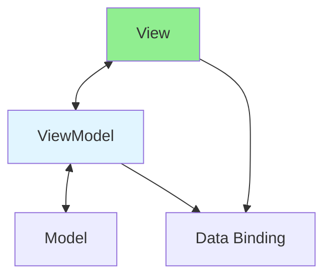

# 13.14 MVVM Pattern / Mẫu MVVM

## Table of Contents / Mục lục
1. [Introduction / Giới thiệu](#introduction--giới-thiệu)
2. [MVVM Components / Thành phần MVVM](#mvvm-components--thành-phần-mvvm)
3. [Implementation / Triển khai](#implementation--triển-khai)
4. [Best Practices / Thực hành tốt nhất](#best-practices--thực-hành-tốt-nhất)
5. [Summary / Tóm tắt](#summary--tóm-tắt)

---

## Introduction / Giới thiệu

### Overview / Tổng quan

**English**: MVVM (Model-View-ViewModel) enables data binding. Learn to implement MVVM for reactive UI updates.

**Vietnamese**: MVVM (Model-View-ViewModel) cho phép data binding. Học cách triển khai MVVM cho cập nhật UI phản ứng.

### MVVM Pattern Flow / Luồng MVVM Pattern



---

## MVVM Components / Thành phần MVVM

### Example 1: MVVM Pattern / Ví dụ 1: MVVM Pattern

```typescript
// MVVM pattern / Mẫu MVVM
// Model / Model
class UserModel {
  getUsers(): User[] {
    return [];
  }
}

// ViewModel / ViewModel
class UserViewModel {
  private users: User[] = [];
  
  loadUsers(): void {
    this.users = new UserModel().getUsers();
    this.notify();
  }
  
  getUsers(): User[] {
    return this.users;
  }
  
  private notify(): void {
    // Notify view / Thông báo view
  }
}

// View / View (React example / Ví dụ React)
function UserView() {
  const viewModel = new UserViewModel();
  const [users, setUsers] = useState([]);
  
  useEffect(() => {
    viewModel.loadUsers();
    setUsers(viewModel.getUsers());
  }, []);
  
  return <div>{users.map(u => <div key={u.id}>{u.name}</div>)}</div>;
}
```

---

## Best Practices / Thực hành tốt nhất

1. **Data binding** - Use framework binding
2. **ViewModel logic** - Presentation logic
3. **Reactive** - Automatic updates
4. **Separation** - Clear boundaries
5. **Testable** - Test ViewModel

---

## Summary / Tóm tắt

### Key Takeaways / Điểm chính

- **Components**: Model, View, ViewModel
- **Binding**: Two-way data binding
- **Reactive**: Automatic UI updates
- **Benefits**: Clean separation

### Next Steps / Bước tiếp theo

- [13.15 Middleware Pattern](./13.15_Middleware_Pattern.md) - Next: Middleware Pattern

---

**Last Updated / Cập nhật lần cuối**: 2024


