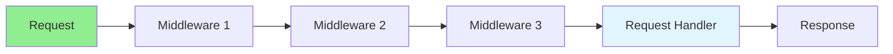

# 13.15 Middleware Pattern / Mẫu Middleware

## Table of Contents / Mục lục
1. [Introduction / Giới thiệu](#introduction--giới-thiệu)
2. [Middleware Structure / Cấu trúc Middleware](#middleware-structure--cấu-trúc-middleware)
3. [Implementation / Triển khai](#implementation--triển-khai)
4. [Best Practices / Thực hành tốt nhất](#best-practices--thực-hành-tốt-nhất)
5. [Summary / Tóm tắt](#summary--tóm-tắt)

---

## Introduction / Giới thiệu

### Overview / Tổng quan

**English**: Middleware processes requests in a chain. Learn to implement middleware for authentication, logging, and request processing.

**Vietnamese**: Middleware xử lý requests trong một chuỗi. Học cách triển khai middleware cho authentication, logging và xử lý request.

### Middleware Pattern Flow / Luồng Middleware Pattern



---

## Middleware Structure / Cấu trúc Middleware

### Example 1: Middleware Pattern / Ví dụ 1: Middleware Pattern

```typescript
// Middleware pattern / Mẫu Middleware
type Middleware = (req: any, res: any, next: () => void) => void;

// Authentication middleware / Middleware xác thực
const authMiddleware: Middleware = (req, res, next) => {
  if (req.headers.authorization) {
    next();
  } else {
    res.status(401).json({ error: 'Unauthorized' });
  }
};

// Logging middleware / Middleware logging
const loggingMiddleware: Middleware = (req, res, next) => {
  console.log(`${req.method} ${req.path}`);
  next();
};

// Apply middleware / Áp dụng middleware
app.use(loggingMiddleware);
app.use(authMiddleware);
app.get('/api/data', (req, res) => {
  res.json({ data: 'protected' });
});
```

---

## Best Practices / Thực hành tốt nhất

1. **Chain order** - Order matters
2. **Call next** - Always call next()
3. **Error handling** - Handle errors properly
4. **Reusable** - Make reusable middleware
5. **Performance** - Consider overhead

---

## Summary / Tóm tắt

### Key Takeaways / Điểm chính

- **Purpose**: Request processing chain
- **Benefits**: Modular and reusable
- **Use cases**: Auth, logging, validation
- **Implementation**: Function chain

### Next Steps / Bước tiếp theo

- [13.16 Design Pattern Best Practices](./13.16_Design_Pattern_Best_Practices.md) - Next: Design Pattern Best Practices

---

**Last Updated / Cập nhật lần cuối**: 2024

