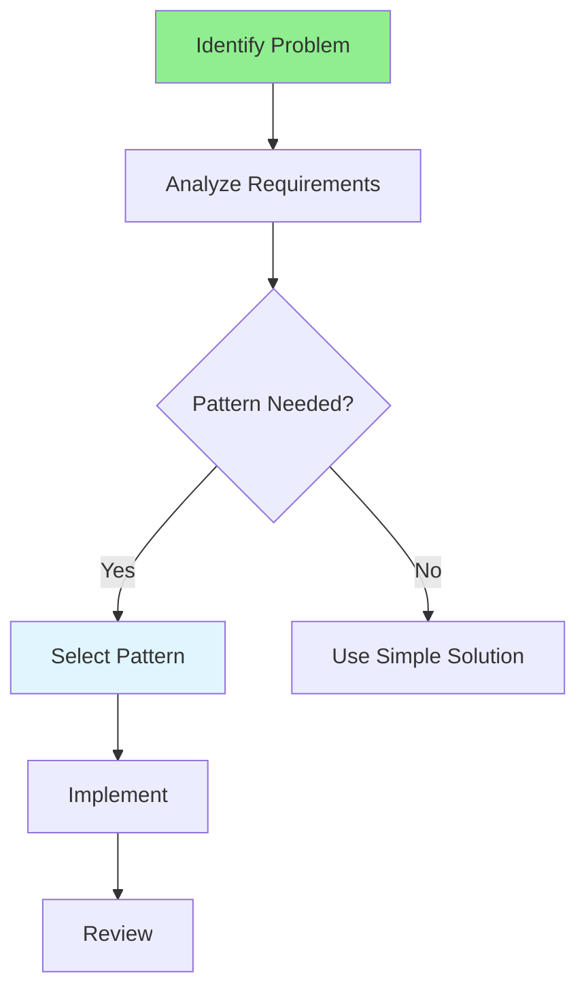

# 13.16 Design Pattern Best Practices / Thực hành tốt nhất Design Pattern

## Table of Contents / Mục lục
1. [Introduction / Giới thiệu](#introduction--giới-thiệu)
2. [When to Use Patterns / Khi nào sử dụng Pattern](#when-to-use-patterns--khi-nào-sử-dụng-pattern)
3. [Pattern Selection / Lựa chọn Pattern](#pattern-selection--lựa-chọn-pattern)
4. [Best Practices / Thực hành tốt nhất](#best-practices--thực-hành-tốt-nhất)
5. [Summary / Tóm tắt](#summary--tóm-tắt)

---

## Introduction / Giới thiệu

### Overview / Tổng quan

**English**: Understanding when and how to use design patterns is crucial. Learn best practices for pattern selection and implementation.

**Vietnamese**: Hiểu khi nào và cách sử dụng design pattern rất quan trọng. Học thực hành tốt nhất cho lựa chọn và triển khai pattern.

### Pattern Selection Flow / Luồng lựa chọn Pattern



---

## When to Use Patterns / Khi nào sử dụng Pattern

### Example 1: Pattern Selection Guide / Ví dụ 1: Hướng dẫn lựa chọn Pattern

```typescript
// Pattern selection guide / Hướng dẫn lựa chọn pattern
const patternSelection = {
  'Need single instance': 'Singleton',
  'Complex object creation': 'Factory or Builder',
  'Event notification': 'Observer',
  'Algorithm selection': 'Strategy',
  'Add behavior dynamically': 'Decorator',
  'Interface compatibility': 'Adapter',
  'Simplify interface': 'Facade',
  'Encapsulate requests': 'Command',
  'Data access abstraction': 'Repository',
  'Loose coupling': 'Dependency Injection'
};

// Decision framework / Khung quyết định
function selectPattern(problem: string): string | null {
  return patternSelection[problem] || null;
}
```

---

## Best Practices / Thực hành tốt nhất

1. **Don't overuse** - Use when appropriate
2. **Understand problem** - Know what you're solving
3. **Start simple** - Don't add complexity unnecessarily
4. **Refactor to patterns** - Add patterns when needed
5. **Learn from code** - Study existing implementations

---

## Summary / Tóm tắt

### Key Takeaways / Điểm chính

- **Selection**: Choose based on problem
- **Timing**: Add when needed
- **Simplicity**: Start simple
- **Refactoring**: Introduce patterns gradually

### Next Steps / Bước tiếp theo

- Complete Group 13: Design Patterns ✅
- Move to [Group 14: Advanced Technologies](../Group-14-Advanced-Tech/) - Coming next

---

**Last Updated / Cập nhật lần cuối**: 2024

