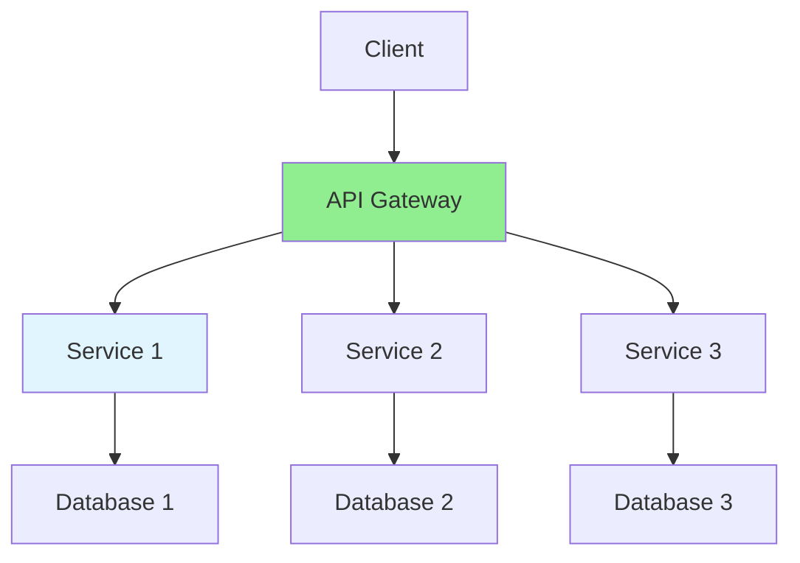

# 14.01 Microservices Architecture / Kiến trúc Microservices

## Table of Contents / Mục lục
1. [Introduction / Giới thiệu](#introduction--giới-thiệu)
2. [Microservices Concepts / Khái niệm Microservices](#microservices-concepts--khái-niệm-microservices)
3. [Implementation / Triển khai](#implementation--triển-khai)
4. [Best Practices / Thực hành tốt nhất](#best-practices--thực-hành-tốt-nhất)
5. [Summary / Tóm tắt](#summary--tóm-tắt)

---

## Introduction / Giới thiệu

### Overview / Tổng quan

**English**: Microservices architecture breaks applications into small, independent services. Learn to design and implement microservices effectively.

**Vietnamese**: Kiến trúc Microservices chia ứng dụng thành các service nhỏ, độc lập. Học cách thiết kế và triển khai microservices hiệu quả.

### Microservices Architecture / Kiến trúc Microservices



---

## Microservices Concepts / Khái niệm Microservices

### Example 1: Microservice Structure / Ví dụ 1: Cấu trúc Microservice

```typescript
// Microservice structure / Cấu trúc microservice
@Module({
  imports: [HttpModule],
  controllers: [UserController],
  providers: [UserService]
})
export class UserServiceModule {}

@Controller('users')
export class UserController {
  constructor(private userService: UserService) {}
  
  @Get(':id')
  async getUser(@Param('id') id: string) {
    return this.userService.findById(id);
  }
}

@Injectable()
export class UserService {
  constructor(private httpService: HttpService) {}
  
  async findById(id: string) {
    // Service logic / Logic service
    return { id, name: 'User' };
  }
}
```

---

## Best Practices / Thực hành tốt nhất

1. **Independent deployment** - Deploy services separately
2. **Database per service** - Isolated data
3. **API communication** - REST or message queues
4. **Service discovery** - Find services dynamically
5. **Monitoring** - Track service health

---

## Summary / Tóm tắt

### Key Takeaways / Điểm chính

- **Independence**: Separate services
- **Communication**: API or messaging
- **Data**: Database per service
- **Deployment**: Independent deployment

### Next Steps / Bước tiếp theo

- [14.02 GraphQL](./14.02_GraphQL.md) - Next: GraphQL

---

**Last Updated / Cập nhật lần cuối**: 2024

