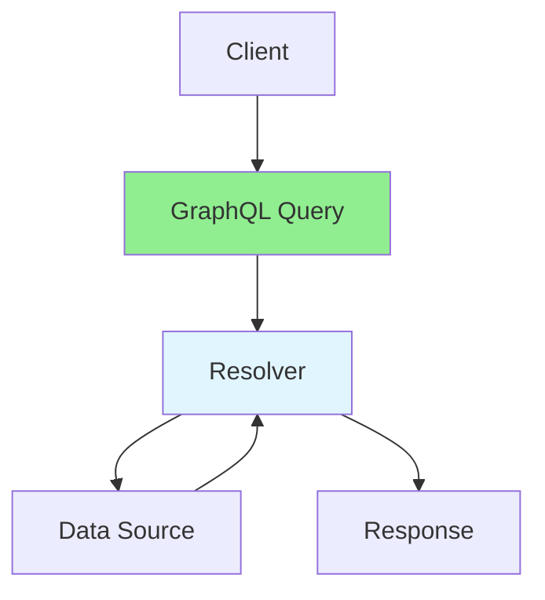

# 14.02 GraphQL / GraphQL

## Table of Contents / Mục lục
1. [Introduction / Giới thiệu](#introduction--giới-thiệu)
2. [GraphQL Basics / Cơ bản GraphQL](#graphql-basics--cơ-bản-graphql)
3. [Implementation / Triển khai](#implementation--triển-khai)
4. [Best Practices / Thực hành tốt nhất](#best-practices--thực-hành-tốt-nhất)
5. [Summary / Tóm tắt](#summary--tóm-tắt)

---

## Introduction / Giới thiệu

### Overview / Tổng quan

**English**: GraphQL is a query language for APIs. Learn to implement GraphQL servers and clients for flexible data fetching.

**Vietnamese**: GraphQL là ngôn ngữ truy vấn cho API. Học cách triển khai GraphQL server và client cho lấy dữ liệu linh hoạt.

### GraphQL Flow / Luồng GraphQL



---

## GraphQL Basics / Cơ bản GraphQL

### Example 1: GraphQL Schema / Ví dụ 1: Schema GraphQL

```typescript
// GraphQL schema / Schema GraphQL
import { buildSchema } from 'graphql';

const schema = buildSchema(`
  type User {
    id: ID!
    name: String!
    email: String!
    posts: [Post!]!
  }
  
  type Post {
    id: ID!
    title: String!
    content: String!
    author: User!
  }
  
  type Query {
    user(id: ID!): User
    users: [User!]!
  }
  
  type Mutation {
    createUser(name: String!, email: String!): User!
  }
`);

// Resolvers / Resolvers
const resolvers = {
  Query: {
    user: async (_, { id }) => {
      return await prisma.user.findUnique({ where: { id } });
    },
    users: async () => {
      return await prisma.user.findMany();
    }
  },
  Mutation: {
    createUser: async (_, { name, email }) => {
      return await prisma.user.create({ data: { name, email } });
    }
  }
};
```

---

## Best Practices / Thực hành tốt nhất

1. **Schema design** - Design schema carefully
2. **N+1 problem** - Use DataLoader
3. **Validation** - Validate inputs
4. **Error handling** - Proper error responses
5. **Performance** - Optimize queries

---

## Summary / Tóm tắt

### Key Takeaways / Điểm chính

- **Query language**: Flexible data fetching
- **Schema**: Type system
- **Resolvers**: Data fetching logic
- **Benefits**: Single endpoint, flexible queries

### Next Steps / Bước tiếp theo

- [14.03 WebSockets Advanced](./14.03_WebSockets_Advanced.md) - Next: WebSockets Advanced

---

**Last Updated / Cập nhật lần cuối**: 2024

