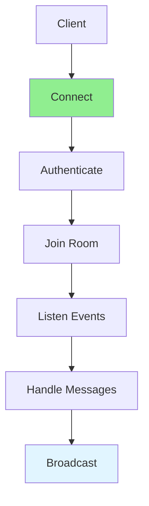

# 14.03 WebSockets Advanced / WebSocket nâng cao

## Table of Contents / Mục lục
1. [Introduction / Giới thiệu](#introduction--giới-thiệu)
2. [Advanced Features / Tính năng nâng cao](#advanced-features--tính-năng-nâng-cao)
3. [Best Practices / Thực hành tốt nhất](#best-practices--thực-hành-tốt-nhất)
4. [Summary / Tóm tắt](#summary--tóm-tắt)

---

## Introduction / Giới thiệu

### Overview / Tổng quan

**English**: Advanced WebSocket features enable robust real-time communication. Learn connection management, scaling, and error handling.

**Vietnamese**: Tính năng WebSocket nâng cao cho phép giao tiếp real-time mạnh mẽ. Học quản lý kết nối, scaling và xử lý lỗi.

### Advanced WebSocket Flow / Luồng WebSocket nâng cao



---

## Advanced Features / Tính năng nâng cao

### Example 1: Advanced WebSocket / Ví dụ 1: WebSocket nâng cao

```typescript
// Advanced WebSocket / WebSocket nâng cao
@WebSocketGateway({
  namespace: 'chat',
  cors: { origin: '*' }
})
export class ChatGateway {
  @WebSocketServer()
  server: Server;
  
  private rooms: Map<string, Set<string>> = new Map();
  
  @SubscribeMessage('join')
  handleJoin(client: Socket, room: string) {
    client.join(room);
    if (!this.rooms.has(room)) {
      this.rooms.set(room, new Set());
    }
    this.rooms.get(room)!.add(client.id);
    this.server.to(room).emit('userJoined', { userId: client.id });
  }
  
  @SubscribeMessage('message')
  handleMessage(client: Socket, payload: { room: string; message: string }) {
    this.server.to(payload.room).emit('message', {
      userId: client.id,
      message: payload.message,
      timestamp: new Date()
    });
  }
}
```

---

## Best Practices / Thực hành tốt nhất

1. **Connection management** - Handle reconnections
2. **Authentication** - Authenticate connections
3. **Room management** - Organize by rooms
4. **Error handling** - Graceful error handling
5. **Scaling** - Use Redis adapter

---

## Summary / Tóm tắt

### Key Takeaways / Điểm chính

- **Rooms**: Organize connections
- **Authentication**: Secure connections
- **Scaling**: Redis adapter
- **Error handling**: Robust error handling

### Next Steps / Bước tiếp theo

- [14.04 Docker & Containers](./14.04_Docker_Containers.md) - Next: Docker & Containers

---

**Last Updated / Cập nhật lần cuối**: 2024


