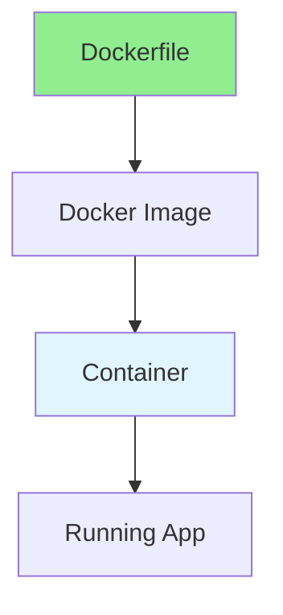
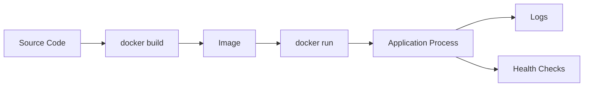
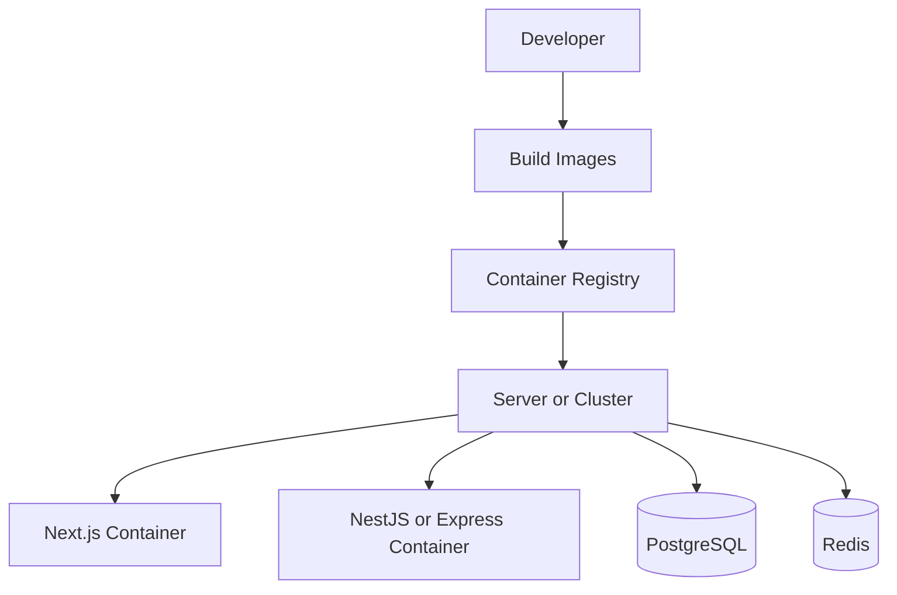

# 14.04 Docker & Containers / Docker & Container

## Table of Contents / Mục lục
1. [Introduction / Giới thiệu](#introduction--giới-thiệu)
2. [Docker Basics / Cơ bản Docker](#docker-basics--cơ-bản-docker)
3. [Dockerfile / Dockerfile](#dockerfile--dockerfile)
4. [Docker Compose / Docker Compose](#docker-compose--docker-compose)
5. [Production Notes / Ghi chú production](#production-notes--ghi-chú-production)
6. [Best Practices / Thực hành tốt nhất](#best-practices--thực-hành-tốt-nhất)
7. [Summary / Tóm tắt](#summary--tóm-tắt)

---

## Introduction / Giới thiệu

### Overview / Tổng quan

**English**: Docker containerizes applications for consistent deployment. Learn to create Dockerfiles, manage containers, and use Docker Compose.

**Vietnamese**: Docker container hóa ứng dụng cho triển khai nhất quán. Học cách tạo Dockerfile, quản lý container và sử dụng Docker Compose.

### Docker Architecture / Kiến trúc Docker



---

## Docker Basics / Cơ bản Docker

### Example 1: Dockerfile / Ví dụ 1: Dockerfile

```dockerfile
# Dockerfile
FROM node:18-alpine

WORKDIR /app

COPY package*.json ./
RUN npm ci --only=production

COPY . .

EXPOSE 3000

CMD ["node", "dist/main.js"]
```

### Example 1B: `.dockerignore` / Ví dụ 1B: `.dockerignore`

```text
node_modules
dist
.git
.env
.env.*
npm-debug.log
coverage
.next
```

### Container Lifecycle / Vòng đời container



---

## Dockerfile / Dockerfile

### Example 2: Multi-stage Build / Ví dụ 2: Multi-stage Build

```dockerfile
# Multi-stage build / Multi-stage build
FROM node:18 AS builder
WORKDIR /app
COPY package*.json ./
RUN npm ci
COPY . .
RUN npm run build

FROM node:18-alpine
WORKDIR /app
COPY --from=builder /app/dist ./dist
COPY --from=builder /app/node_modules ./node_modules
COPY package*.json ./
EXPOSE 3000
CMD ["node", "dist/main.js"]
```

### Example 3: Production-Friendly Dockerfile / Ví dụ 3: Dockerfile thân thiện production

```dockerfile
FROM node:20-alpine AS builder
WORKDIR /app

COPY package*.json ./
RUN npm ci

COPY . .
RUN npm run build

FROM node:20-alpine AS runner
WORKDIR /app
ENV NODE_ENV=production

COPY package*.json ./
RUN npm ci --omit=dev && npm cache clean --force

COPY --from=builder /app/dist ./dist

RUN addgroup -S appgroup && adduser -S appuser -G appgroup
USER appuser

EXPOSE 3000
CMD ["node", "dist/main.js"]
```

---

## Docker Compose / Docker Compose

### Example 4: Full-Stack Compose Setup / Ví dụ 4: Thiết lập Compose cho full-stack

```yaml
services:
  web:
    build: ./web
    ports:
      - "3000:3000"
    depends_on:
      - api

  api:
    build: ./api
    ports:
      - "4000:4000"
    environment:
      DATABASE_URL: postgresql://app:secret@db:5432/app
      REDIS_URL: redis://redis:6379
    depends_on:
      - db
      - redis

  db:
    image: postgres:16
    environment:
      POSTGRES_DB: app
      POSTGRES_USER: app
      POSTGRES_PASSWORD: secret
    volumes:
      - postgres_data:/var/lib/postgresql/data

  redis:
    image: redis:7-alpine

volumes:
  postgres_data:
```

### Example 5: Health Check / Ví dụ 5: Health check

```dockerfile
HEALTHCHECK --interval=30s --timeout=5s --start-period=10s --retries=3 \
  CMD wget --no-verbose --tries=1 --spider http://localhost:3000/health || exit 1
```

---

## Production Notes / Ghi chú production

### Where Docker Helps Most / Docker giúp nhiều nhất ở đâu

- local environment consistency
- repeatable builds
- CI/CD delivery
- easier rollback with immutable images
- cleaner separation between app and host machine

### Common Full-Stack Pattern / Mẫu full-stack phổ biến



### Checklist / Danh sách kiểm tra

- image builds from clean source
- environment variables are injected, not committed
- container runs as non-root user
- health endpoint exists
- logs go to stdout or stderr
- image size is reasonable
- development dependencies are excluded in production image

---

## Best Practices / Thực hành tốt nhất

1. **Use .dockerignore** - Exclude unnecessary files
2. **Layer caching** - Order commands efficiently
3. **Multi-stage builds** - Reduce image size
4. **Security** - Use non-root user
5. **Health checks** - Add health checks
6. **One process per container** - Keep responsibility clear
7. **Immutable images** - Build once, deploy many times

---

## Summary / Tóm tắt

### Key Takeaways / Điểm chính

- **Containerization**: Package applications
- **Dockerfile**: Build instructions
- **Images**: Reusable packages
- **Containers**: Running instances
- **Compose**: Coordinate multi-service environments
- **Production**: Prefer non-root, health checks, and smaller images

### Next Steps / Bước tiếp theo

- [14.05 Kubernetes Basics](./14.05_Kubernetes_Basics.md) - Next: Kubernetes Basics

---

**Last Updated / Cập nhật lần cuối**: 2024

