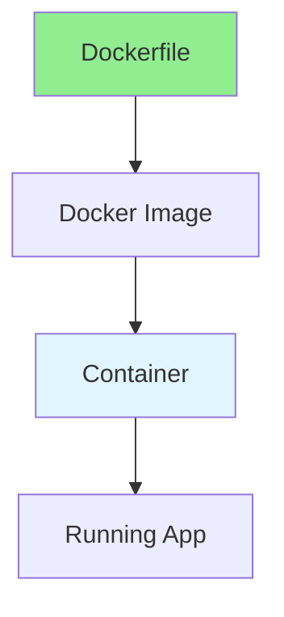

# 14.04 Docker & Containers / Docker & Container

## Table of Contents / Mục lục
1. [Introduction / Giới thiệu](#introduction--giới-thiệu)
2. [Docker Basics / Cơ bản Docker](#docker-basics--cơ-bản-docker)
3. [Dockerfile / Dockerfile](#dockerfile--dockerfile)
4. [Best Practices / Thực hành tốt nhất](#best-practices--thực-hành-tốt-nhất)
5. [Summary / Tóm tắt](#summary--tóm-tắt)

---

## Introduction / Giới thiệu

### Overview / Tổng quan

**English**: Docker containerizes applications for consistent deployment. Learn to create Dockerfiles, manage containers, and use Docker Compose.

**Vietnamese**: Docker container hóa ứng dụng cho triển khai nhất quán. Học cách tạo Dockerfile, quản lý container và sử dụng Docker Compose.

### Docker Architecture / Kiến trúc Docker



---

## Docker Basics / Cơ bản Docker

### Example 1: Dockerfile / Ví dụ 1: Dockerfile

```dockerfile
# Dockerfile
FROM node:18-alpine

WORKDIR /app

COPY package*.json ./
RUN npm ci --only=production

COPY . .

EXPOSE 3000

CMD ["node", "dist/main.js"]
```

---

## Dockerfile / Dockerfile

### Example 2: Multi-stage Build / Ví dụ 2: Multi-stage Build

```dockerfile
# Multi-stage build / Multi-stage build
FROM node:18 AS builder
WORKDIR /app
COPY package*.json ./
RUN npm ci
COPY . .
RUN npm run build

FROM node:18-alpine
WORKDIR /app
COPY --from=builder /app/dist ./dist
COPY --from=builder /app/node_modules ./node_modules
COPY package*.json ./
EXPOSE 3000
CMD ["node", "dist/main.js"]
```

---

## Best Practices / Thực hành tốt nhất

1. **Use .dockerignore** - Exclude unnecessary files
2. **Layer caching** - Order commands efficiently
3. **Multi-stage builds** - Reduce image size
4. **Security** - Use non-root user
5. **Health checks** - Add health checks

---

## Summary / Tóm tắt

### Key Takeaways / Điểm chính

- **Containerization**: Package applications
- **Dockerfile**: Build instructions
- **Images**: Reusable packages
- **Containers**: Running instances

### Next Steps / Bước tiếp theo

- [14.05 Kubernetes Basics](./14.05_Kubernetes_Basics.md) - Next: Kubernetes Basics

---

**Last Updated / Cập nhật lần cuối**: 2024


