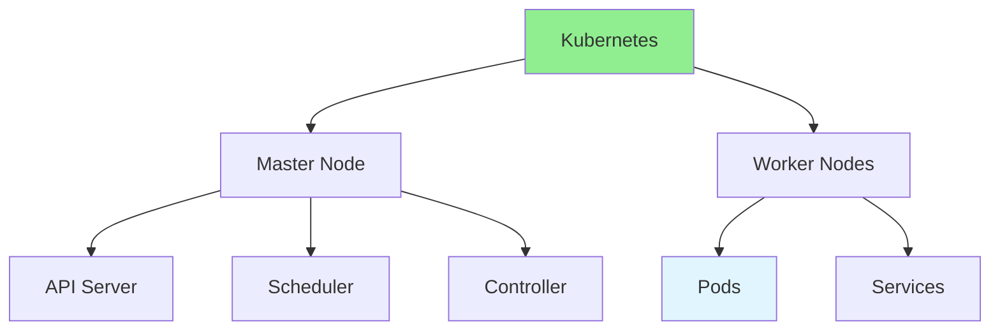

# 14.05 Kubernetes Basics / Cơ bản Kubernetes

## Table of Contents / Mục lục
1. [Introduction / Giới thiệu](#introduction--giới-thiệu)
2. [Kubernetes Concepts / Khái niệm Kubernetes](#kubernetes-concepts--khái-niệm-kubernetes)
3. [Best Practices / Thực hành tốt nhất](#best-practices--thực-hành-tốt-nhất)
4. [Summary / Tóm tắt](#summary--tóm-tắt)

---

## Introduction / Giới thiệu

### Overview / Tổng quan

**English**: Kubernetes orchestrates containers at scale. Learn basic Kubernetes concepts, pods, services, and deployments.

**Vietnamese**: Kubernetes điều phối container ở quy mô lớn. Học khái niệm Kubernetes cơ bản, pods, services và deployments.

### Kubernetes Architecture / Kiến trúc Kubernetes



---

## Kubernetes Concepts / Khái niệm Kubernetes

### Example 1: Kubernetes Deployment / Ví dụ 1: Kubernetes Deployment

```yaml
# deployment.yaml
apiVersion: apps/v1
kind: Deployment
metadata:
  name: user-service
spec:
  replicas: 3
  selector:
    matchLabels:
      app: user-service
  template:
    metadata:
      labels:
        app: user-service
    spec:
      containers:
      - name: user-service
        image: user-service:latest
        ports:
        - containerPort: 3000
        env:
        - name: DATABASE_URL
          valueFrom:
            secretKeyRef:
              name: db-secret
              key: url
```

---

## Best Practices / Thực hành tốt nhất

1. **Resource limits** - Set CPU and memory limits
2. **Health checks** - Liveness and readiness probes
3. **Scaling** - Use HPA for auto-scaling
4. **Secrets** - Use Kubernetes secrets
5. **Monitoring** - Monitor pod health

---

## Summary / Tóm tắt

### Key Takeaways / Điểm chính

- **Pods**: Smallest deployable units
- **Services**: Expose pods
- **Deployments**: Manage replicas
- **Scaling**: Horizontal pod autoscaling

### Next Steps / Bước tiếp theo

- [14.06 Message Queues](./14.06_Message_Queues.md) - Next: Message Queues

---

**Last Updated / Cập nhật lần cuối**: 2024


