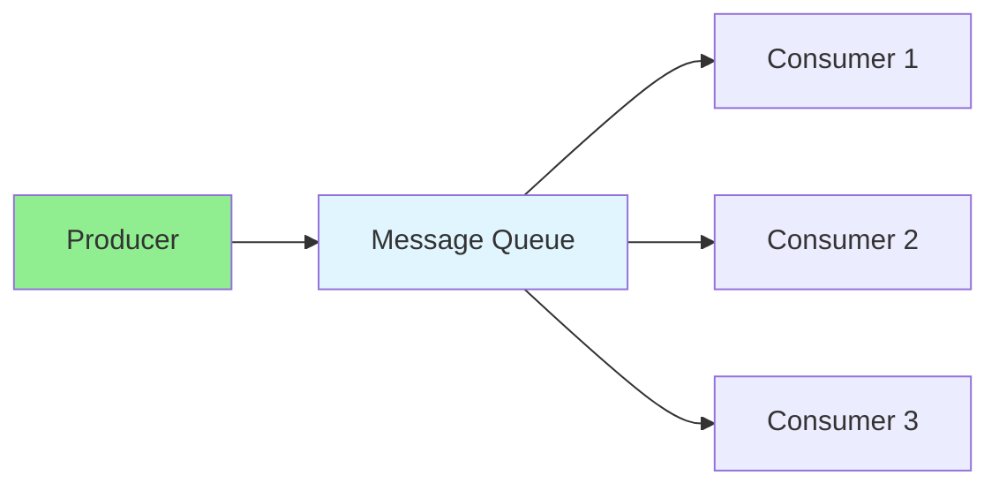

# 14.06 Message Queues / Hàng đợi tin nhắn

## Table of Contents / Mục lục
1. [Introduction / Giới thiệu](#introduction--giới-thiệu)
2. [Queue Types / Loại hàng đợi](#queue-types--loại-hàng-đợi)
3. [Implementation / Triển khai](#implementation--triển-khai)
4. [Best Practices / Thực hành tốt nhất](#best-practices--thực-hành-tốt-nhất)
5. [Summary / Tóm tắt](#summary--tóm-tắt)

---

## Introduction / Giới thiệu

### Overview / Tổng quan

**English**: Message queues enable asynchronous communication. Learn to use RabbitMQ, Kafka, and other message brokers.

**Vietnamese**: Hàng đợi tin nhắn cho phép giao tiếp bất đồng bộ. Học cách sử dụng RabbitMQ, Kafka và các message broker khác.

### Message Queue Flow / Luồng Message Queue



---

## Queue Types / Loại hàng đợi

### Example 1: RabbitMQ / Ví dụ 1: RabbitMQ

```typescript
// RabbitMQ / RabbitMQ
import amqp from 'amqplib';

// Producer / Producer
async function publishMessage(queue: string, message: string) {
  const connection = await amqp.connect('amqp://localhost');
  const channel = await connection.createChannel();
  
  await channel.assertQueue(queue, { durable: true });
  channel.sendToQueue(queue, Buffer.from(message), { persistent: true });
  
  await channel.close();
  await connection.close();
}

// Consumer / Consumer
async function consumeMessages(queue: string) {
  const connection = await amqp.connect('amqp://localhost');
  const channel = await connection.createChannel();
  
  await channel.assertQueue(queue, { durable: true });
  channel.consume(queue, (msg) => {
    if (msg) {
      console.log('Received:', msg.content.toString());
      channel.ack(msg);
    }
  });
}
```

---

## Best Practices / Thực hành tốt nhất

1. **Durability** - Make queues durable
2. **Acknowledgments** - Acknowledge messages
3. **Error handling** - Handle failures
4. **Dead letter queues** - Handle failed messages
5. **Monitoring** - Monitor queue health

---

## Summary / Tóm tắt

### Key Takeaways / Điểm chính

- **Asynchronous**: Decouple producers and consumers
- **Reliability**: Durable and persistent
- **Scalability**: Handle high throughput
- **Tools**: RabbitMQ, Kafka, Redis

### Next Steps / Bước tiếp theo

- [14.07 API Gateway](./14.07_API_Gateway.md) - Next: API Gateway

---

**Last Updated / Cập nhật lần cuối**: 2024

