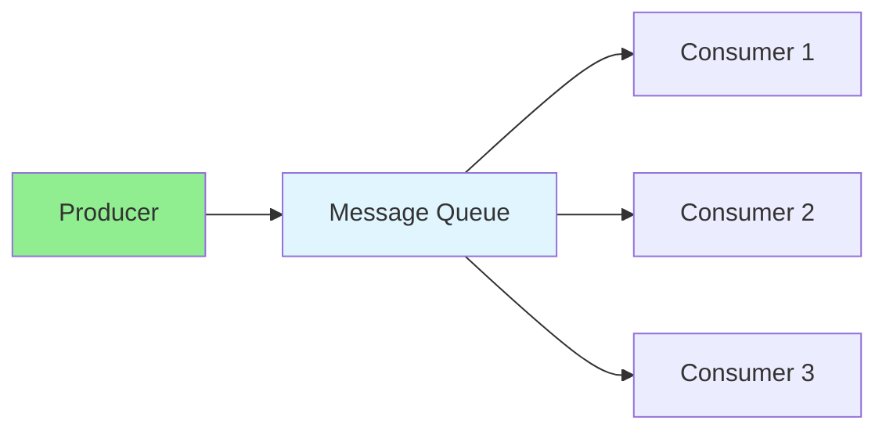
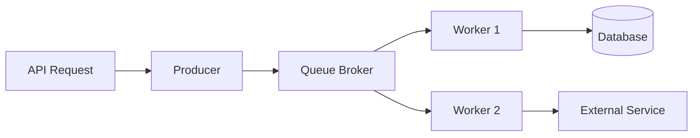
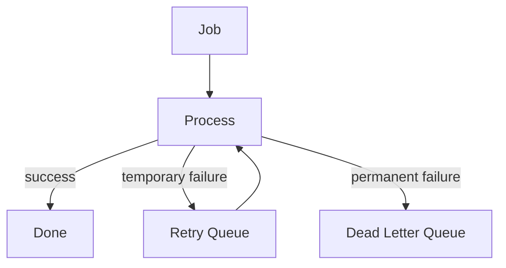

# 14.06 Message Queues / Hàng đợi tin nhắn

## Table of Contents / Mục lục
1. [Introduction / Giới thiệu](#introduction--giới-thiệu)
2. [Queue Types / Loại hàng đợi](#queue-types--loại-hàng-đợi)
3. [Implementation / Triển khai](#implementation--triển-khai)
4. [Queue Patterns / Mẫu sử dụng queue](#queue-patterns--mẫu-sử-dụng-queue)
5. [Failure Handling / Xử lý lỗi](#failure-handling--xử-lý-lỗi)
6. [Best Practices / Thực hành tốt nhất](#best-practices--thực-hành-tốt-nhất)
7. [Summary / Tóm tắt](#summary--tóm-tắt)

---

## Introduction / Giới thiệu

### Overview / Tổng quan

**English**: Message queues enable asynchronous communication. Learn to use RabbitMQ, Kafka, and other message brokers.

**Vietnamese**: Hàng đợi tin nhắn cho phép giao tiếp bất đồng bộ. Học cách sử dụng RabbitMQ, Kafka và các message broker khác.

### Message Queue Flow / Luồng Message Queue



---

## Queue Types / Loại hàng đợi

### Example 1: RabbitMQ / Ví dụ 1: RabbitMQ

```typescript
// RabbitMQ / RabbitMQ
import amqp from 'amqplib';

// Producer / Producer
async function publishMessage(queue: string, message: string) {
  const connection = await amqp.connect('amqp://localhost');
  const channel = await connection.createChannel();
  
  await channel.assertQueue(queue, { durable: true });
  channel.sendToQueue(queue, Buffer.from(message), { persistent: true });
  
  await channel.close();
  await connection.close();
}

// Consumer / Consumer
async function consumeMessages(queue: string) {
  const connection = await amqp.connect('amqp://localhost');
  const channel = await connection.createChannel();
  
  await channel.assertQueue(queue, { durable: true });
  channel.consume(queue, (msg) => {
    if (msg) {
      console.log('Received:', msg.content.toString());
      channel.ack(msg);
    }
  });
}
```

### Common Queue Models / Các mô hình queue phổ biến

- work queue: one message processed by one worker
- pub/sub: one message broadcast to many subscribers
- delayed jobs: execute later
- retry queue: retry transient failures
- dead-letter queue: isolate permanently failed messages

---

## Implementation / Triển khai

### Example 2: BullMQ Job / Ví dụ 2: Job với BullMQ

```typescript
import { Queue, Worker } from 'bullmq';

const emailQueue = new Queue('email', {
  connection: { host: 'localhost', port: 6379 },
});

await emailQueue.add('welcome-email', {
  userId: 42,
  email: 'user@example.com',
});

const worker = new Worker(
  'email',
  async (job) => {
    console.log('Processing job', job.name, job.data);
  },
  { connection: { host: 'localhost', port: 6379 } }
);
```

### Message Flow / Luồng message



---

## Queue Patterns / Mẫu sử dụng queue

### Good Use Cases / Trường hợp dùng tốt

- sending emails
- resizing images
- generating reports
- payment retry workflows
- webhook delivery
- analytics ingestion

### When Not To Use A Queue / Khi không nên dùng queue

- tiny synchronous operations that finish quickly
- workflows requiring immediate user-visible result
- cases where complexity exceeds actual system need

---

## Failure Handling / Xử lý lỗi

### Example 3: Retry and Dead Letter Strategy / Ví dụ 3: Retry và dead letter



### Things To Handle / Những thứ cần xử lý

- duplicate delivery
- worker crashes
- poison messages
- long-running jobs
- idempotency
- visibility into retry counts

### Example 4: Idempotent Consumer Note / Ví dụ 4: Ghi chú về consumer idempotent

```typescript
async function handleJob(jobId: string) {
  const alreadyProcessed = await prisma.processedJob.findUnique({
    where: { jobId },
  });

  if (alreadyProcessed) return;

  // Perform side effects safely / Thực hiện side effect an toàn
}
```

---

## Best Practices / Thực hành tốt nhất

1. **Durability** - Make queues durable
2. **Acknowledgments** - Acknowledge messages
3. **Error handling** - Handle failures
4. **Dead letter queues** - Handle failed messages
5. **Monitoring** - Monitor queue health
6. **Idempotency** - Consumers must tolerate duplicate processing
7. **Keep payloads lean** - Avoid oversized messages
8. **Separate job types** - Different workloads often need separate queues

---

## Summary / Tóm tắt

### Key Takeaways / Điểm chính

- **Asynchronous**: Decouple producers and consumers
- **Reliability**: Durable and persistent
- **Scalability**: Handle high throughput
- **Tools**: RabbitMQ, Kafka, Redis
- **Patterns**: Work queues, retries, and dead-letter handling matter
- **Safety**: Queue systems need idempotency and observability

### Next Steps / Bước tiếp theo

- [14.07 API Gateway](./14.07_API_Gateway.md) - Next: API Gateway

---

**Last Updated / Cập nhật lần cuối**: 2024

