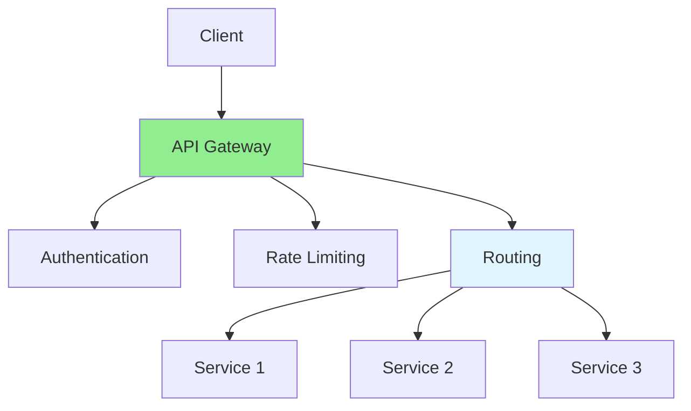
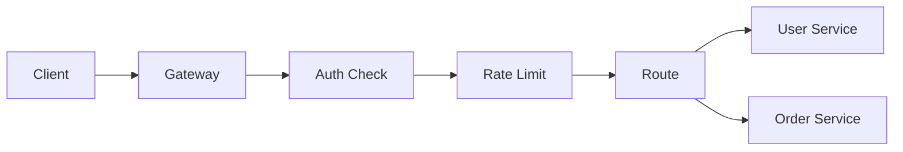

# 14.07 API Gateway / API Gateway

## Table of Contents / Mục lục
1. [Introduction / Giới thiệu](#introduction--giới-thiệu)
2. [Gateway Functions / Chức năng Gateway](#gateway-functions--chức-năng-gateway)
3. [Implementation / Triển khai](#implementation--triển-khai)
4. [When To Use A Gateway / Khi nào nên dùng gateway](#when-to-use-a-gateway--khi-nào-nên-dùng-gateway)
5. [Risks / Rủi ro](#risks--rủi-ro)
6. [Best Practices / Thực hành tốt nhất](#best-practices--thực-hành-tốt-nhất)
7. [Summary / Tóm tắt](#summary--tóm-tắt)

---

## Introduction / Giới thiệu

### Overview / Tổng quan

**English**: API Gateway is a single entry point for microservices. Learn to implement routing, authentication, and rate limiting.

**Vietnamese**: API Gateway là điểm vào duy nhất cho microservices. Học cách triển khai routing, authentication và rate limiting.

### API Gateway Flow / Luồng API Gateway



---

## Gateway Functions / Chức năng Gateway

### Example 1: API Gateway / Ví dụ 1: API Gateway

```typescript
// API Gateway / API Gateway
@Controller()
export class ApiGatewayController {
  constructor(
    private httpService: HttpService,
    private authService: AuthService
  ) {}
  
  @Get('users/:id')
  @UseGuards(AuthGuard)
  async getUser(@Param('id') id: string) {
    return this.httpService.get(`http://user-service/users/${id}`).toPromise();
  }
  
  @Post('orders')
  @UseGuards(AuthGuard, RateLimitGuard)
async createOrder(@Body() order: OrderDto) {
    return this.httpService.post('http://order-service/orders', order).toPromise();
  }
}
```

### Gateway Request Path / Đường đi request qua gateway



---

## When To Use A Gateway / Khi nào nên dùng gateway

### Good Use Cases / Trường hợp dùng tốt

- many backend services
- centralized auth and rate limiting
- unified API surface for frontend clients
- request aggregation across services

### When It May Be Overkill / Khi có thể là thừa

- very small systems
- one or two simple services
- no need for centralized policy enforcement

---

## Risks / Rủi ro

### Common Risks / Rủi ro phổ biến

- turning the gateway into a bottleneck
- pushing too much business logic into the gateway
- creating a single point of failure
- hiding bad service boundaries behind routing

### Design Rule / Quy tắc thiết kế

Keep the gateway focused on cross-cutting concerns, not domain-heavy orchestration.

---

## Best Practices / Thực hành tốt nhất

1. **Single entry point** - One gateway for all services
2. **Authentication** - Centralized auth
3. **Rate limiting** - Protect services
4. **Load balancing** - Distribute load
5. **Monitoring** - Track gateway metrics
6. **Keep routing clear** - Avoid hidden complexity
7. **Observe gateway latency** - It should not become the slowest hop
8. **Limit business logic** - Prefer services to own domain behavior

---

## Summary / Tóm tắt

### Key Takeaways / Điểm chính

- **Entry point**: Single API endpoint
- **Functions**: Auth, routing, rate limiting
- **Benefits**: Simplified client, centralized control
- **Tools**: Kong, AWS API Gateway, Zuul
- **Use case**: Best when many services need a unified edge
- **Risk**: A bloated gateway becomes a bottleneck and maintenance problem

### Next Steps / Bước tiếp theo

- [14.08 Service Mesh](./14.08_Service_Mesh.md) - Next: Service Mesh

---

**Last Updated / Cập nhật lần cuối**: 2024

