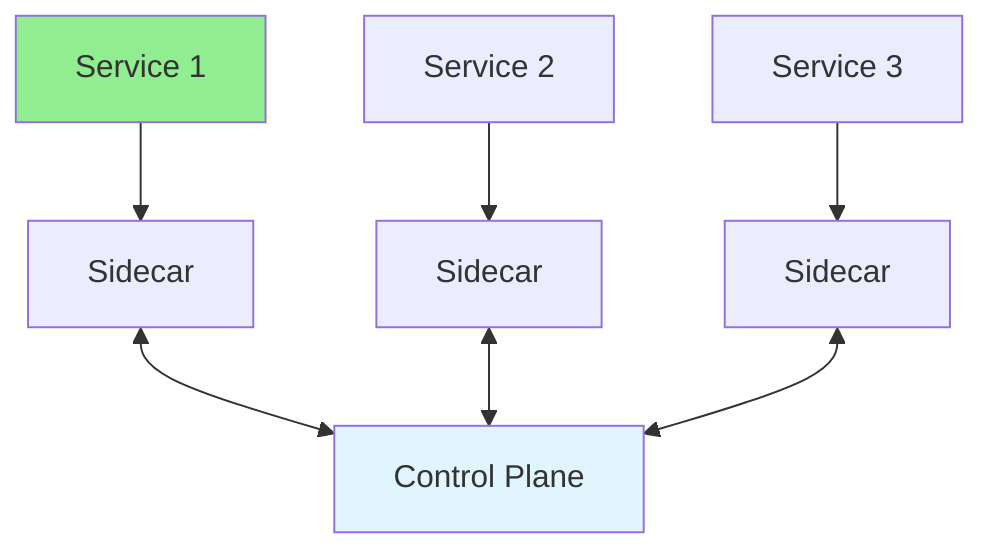

# 14.08 Service Mesh / Service Mesh

## Table of Contents / Mục lục
1. [Introduction / Giới thiệu](#introduction--giới-thiệu)
2. [Service Mesh Concepts / Khái niệm Service Mesh](#service-mesh-concepts--khái-niệm-service-mesh)
3. [Best Practices / Thực hành tốt nhất](#best-practices--thực-hành-tốt-nhất)
4. [Summary / Tóm tắt](#summary--tóm-tắt)

---

## Introduction / Giới thiệu

### Overview / Tổng quan

**English**: Service mesh manages service-to-service communication. Learn about Istio, Linkerd, and service mesh patterns.

**Vietnamese**: Service mesh quản lý giao tiếp giữa các service. Học về Istio, Linkerd và các mẫu service mesh.

### Service Mesh Architecture / Kiến trúc Service Mesh



---

## Service Mesh Concepts / Khái niệm Service Mesh

### Example 1: Service Mesh Benefits / Ví dụ 1: Lợi ích Service Mesh

```typescript
// Service mesh provides / Service mesh cung cấp
const serviceMeshFeatures = {
  trafficManagement: 'Load balancing, routing, circuit breaking',
  security: 'mTLS, authentication, authorization',
  observability: 'Metrics, tracing, logging',
  policy: 'Rate limiting, access control'
};

// Service communication / Giao tiếp service
class ServiceMesh {
  // Automatic mTLS / mTLS tự động
  communicate(serviceA: string, serviceB: string): void {
    // Service mesh handles encryption / Service mesh xử lý mã hóa
    console.log(`Secure communication between ${serviceA} and ${serviceB}`);
  }
  
  // Load balancing / Cân bằng tải
  routeRequest(service: string): string {
    // Service mesh routes to healthy instance / Service mesh route đến instance khỏe mạnh
    return `Route to ${service}`;
  }
}
```

---

## Best Practices / Thực hành tốt nhất

1. **Use for microservices** - Complex service communication
2. **mTLS** - Encrypt service communication
3. **Observability** - Use mesh for monitoring
4. **Policy enforcement** - Centralized policies
5. **Performance** - Consider overhead

---

## Summary / Tóm tắt

### Key Takeaways / Điểm chính

- **Purpose**: Service communication management
- **Features**: Traffic, security, observability
- **Tools**: Istio, Linkerd, Consul
- **Benefits**: Centralized control

### Next Steps / Bước tiếp theo

- [14.09 Serverless](./14.09_Serverless.md) - Next: Serverless

---

**Last Updated / Cập nhật lần cuối**: 2024

