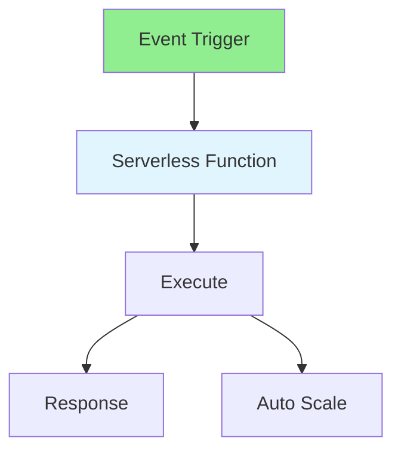

# 14.09 Serverless / Serverless

## Table of Contents / Mục lục
1. [Introduction / Giới thiệu](#introduction--giới-thiệu)
2. [Serverless Concepts / Khái niệm Serverless](#serverless-concepts--khái-niệm-serverless)
3. [Implementation / Triển khai](#implementation--triển-khai)
4. [Best Practices / Thực hành tốt nhất](#best-practices--thực-hành-tốt-nhất)
5. [Summary / Tóm tắt](#summary--tóm-tắt)

---

## Introduction / Giới thiệu

### Overview / Tổng quan

**English**: Serverless runs code without managing servers. Learn to build serverless functions with AWS Lambda, Azure Functions, and Vercel.

**Vietnamese**: Serverless chạy code mà không quản lý server. Học cách xây dựng serverless functions với AWS Lambda, Azure Functions và Vercel.

### Serverless Architecture / Kiến trúc Serverless



---

## Serverless Concepts / Khái niệm Serverless

### Example 1: AWS Lambda / Ví dụ 1: AWS Lambda

```typescript
// AWS Lambda function / Function AWS Lambda
export const handler = async (event: any) => {
  const { name } = JSON.parse(event.body);
  
  try {
    // Process request / Xử lý request
    const result = await processRequest(name);
    
    return {
      statusCode: 200,
      body: JSON.stringify({ message: 'Success', result })
    };
  } catch (error) {
    return {
      statusCode: 500,
      body: JSON.stringify({ error: error.message })
    };
  }
};

// Vercel serverless function / Serverless function Vercel
export default async function handler(req: any, res: any) {
  if (req.method === 'POST') {
    const data = req.body;
    // Process / Xử lý
    res.status(200).json({ success: true });
  } else {
    res.status(405).json({ error: 'Method not allowed' });
  }
}
```

---

## Best Practices / Thực hành tốt nhất

1. **Stateless** - Functions should be stateless
2. **Cold starts** - Minimize cold start time
3. **Timeouts** - Set appropriate timeouts
4. **Error handling** - Handle errors gracefully
5. **Monitoring** - Monitor function performance

---

## Summary / Tóm tắt

### Key Takeaways / Điểm chính

- **No servers**: Managed by platform
- **Event-driven**: Triggered by events
- **Auto-scaling**: Scales automatically
- **Pay-per-use**: Pay for execution time

### Next Steps / Bước tiếp theo

- [14.10 Cloud Services](./14.10_Cloud_Services.md) - Next: Cloud Services

---

**Last Updated / Cập nhật lần cuối**: 2024


