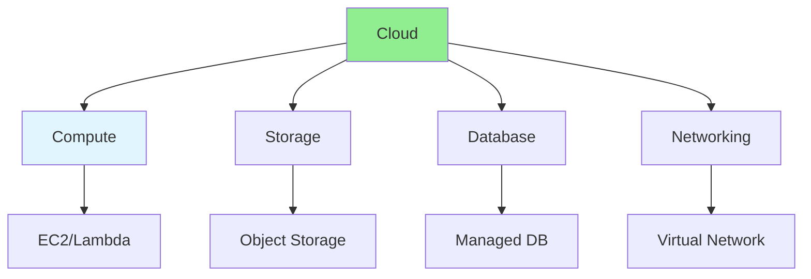

# 14.10 Cloud Services / Dịch vụ đám mây

## Table of Contents / Mục lục
1. [Introduction / Giới thiệu](#introduction--giới-thiệu)
2. [Cloud Providers / Nhà cung cấp đám mây](#cloud-providers--nhà-cung-cấp-đám-mây)
3. [Common Services / Dịch vụ phổ biến](#common-services--dịch-vụ-phổ-biến)
4. [Best Practices / Thực hành tốt nhất](#best-practices--thực-hành-tốt-nhất)
5. [Summary / Tóm tắt](#summary--tóm-tắt)

---

## Introduction / Giới thiệu

### Overview / Tổng quan

**English**: Cloud services provide scalable infrastructure. Learn to use AWS, Azure, and GCP services for applications.

**Vietnamese**: Dịch vụ đám mây cung cấp hạ tầng có thể mở rộng. Học cách sử dụng dịch vụ AWS, Azure và GCP cho ứng dụng.

### Cloud Services / Dịch vụ đám mây



---

## Cloud Providers / Nhà cung cấp đám mây

### Example 1: Cloud Services Comparison / Ví dụ 1: So sánh dịch vụ đám mây

```typescript
// Cloud services / Dịch vụ đám mây
const cloudServices = {
  aws: {
    compute: 'EC2, Lambda, ECS',
    storage: 'S3, EBS, EFS',
    database: 'RDS, DynamoDB, ElastiCache',
    networking: 'VPC, CloudFront, API Gateway'
  },
  azure: {
    compute: 'Virtual Machines, Functions, App Service',
    storage: 'Blob Storage, Files, Disks',
    database: 'SQL Database, Cosmos DB, Redis',
    networking: 'Virtual Network, CDN, API Management'
  },
  gcp: {
    compute: 'Compute Engine, Cloud Functions, GKE',
    storage: 'Cloud Storage, Persistent Disk',
    database: 'Cloud SQL, Firestore, Bigtable',
    networking: 'VPC, Cloud CDN, Cloud Endpoints'
  }
};
```

---

## Common Services / Dịch vụ phổ biến

### Example 2: AWS S3 Usage / Ví dụ 2: Sử dụng AWS S3

```typescript
// AWS S3 / AWS S3
import { S3Client, PutObjectCommand, GetObjectCommand } from '@aws-sdk/client-s3';

const s3Client = new S3Client({ region: 'us-east-1' });

// Upload file / Upload file
async function uploadFile(bucket: string, key: string, body: Buffer) {
  const command = new PutObjectCommand({
    Bucket: bucket,
    Key: key,
    Body: body
  });
  return await s3Client.send(command);
}

// Download file / Download file
async function downloadFile(bucket: string, key: string) {
  const command = new GetObjectCommand({
    Bucket: bucket,
    Key: key
  });
  const response = await s3Client.send(command);
  return response.Body;
}
```

---

## Best Practices / Thực hành tốt nhất

1. **Choose right service** - Match needs to services
2. **Cost optimization** - Monitor and optimize costs
3. **Security** - Use IAM and encryption
4. **Monitoring** - Track usage and performance
5. **Backup** - Implement backup strategies

---

## Summary / Tóm tắt

### Key Takeaways / Điểm chính

- **Providers**: AWS, Azure, GCP
- **Services**: Compute, storage, database, networking
- **Benefits**: Scalability, managed services
- **Cost**: Pay-as-you-go model

### Next Steps / Bước tiếp theo

- [14.11 CI/CD Pipelines](./14.11_CI_CD_Pipelines.md) - Next: CI/CD Pipelines

---

**Last Updated / Cập nhật lần cuối**: 2024

