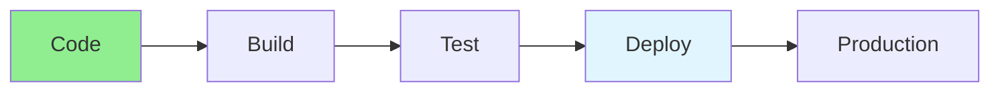

# 14.11 CI/CD Pipelines / Pipeline CI/CD

## Table of Contents / Mục lục
1. [Introduction / Giới thiệu](#introduction--giới-thiệu)
2. [Pipeline Stages / Giai đoạn Pipeline](#pipeline-stages--giai-đoạn-pipeline)
3. [Implementation / Triển khai](#implementation--triển-khai)
4. [Best Practices / Thực hành tốt nhất](#best-practices--thực-hành-tốt-nhất)
5. [Summary / Tóm tắt](#summary--tóm-tắt)

---

## Introduction / Giới thiệu

### Overview / Tổng quan

**English**: CI/CD pipelines automate build, test, and deployment. Learn to create effective pipelines with GitHub Actions, GitLab CI, and Jenkins.

**Vietnamese**: Pipeline CI/CD tự động hóa build, test và deployment. Học cách tạo pipeline hiệu quả với GitHub Actions, GitLab CI và Jenkins.

### CI/CD Pipeline Flow / Luồng Pipeline CI/CD



---

## Pipeline Stages / Giai đoạn Pipeline

### Example 1: GitHub Actions / Ví dụ 1: GitHub Actions

```yaml
# .github/workflows/ci-cd.yml
name: CI/CD Pipeline

on:
  push:
    branches: [ main, develop ]
  pull_request:
    branches: [ main ]

jobs:
  test:
    runs-on: ubuntu-latest
    steps:
      - uses: actions/checkout@v3
      - uses: actions/setup-node@v3
        with:
          node-version: '18'
      - run: npm ci
      - run: npm test
      - run: npm run lint
  
  build:
    needs: test
    runs-on: ubuntu-latest
    steps:
      - uses: actions/checkout@v3
      - run: npm ci
      - run: npm run build
      - uses: actions/upload-artifact@v3
        with:
          name: dist
          path: dist
  
  deploy:
    needs: build
    runs-on: ubuntu-latest
    if: github.ref == 'refs/heads/main'
    steps:
      - uses: actions/download-artifact@v3
        with:
          name: dist
      - name: Deploy
        run: echo "Deploy to production"
```

---

## Best Practices / Thực hành tốt nhất

1. **Fast feedback** - Quick test cycles
2. **Parallel jobs** - Run tests in parallel
3. **Artifacts** - Store build artifacts
4. **Secrets** - Use secure secrets
5. **Rollback** - Plan for rollback

---

## Summary / Tóm tắt

### Key Takeaways / Điểm chính

- **CI**: Continuous integration
- **CD**: Continuous deployment
- **Automation**: Automated workflows
- **Tools**: GitHub Actions, GitLab CI, Jenkins

### Next Steps / Bước tiếp theo

- [14.12 Monitoring & Observability](./14.12_Monitoring_Observability.md) - Next: Monitoring & Observability

---

**Last Updated / Cập nhật lần cuối**: 2024


