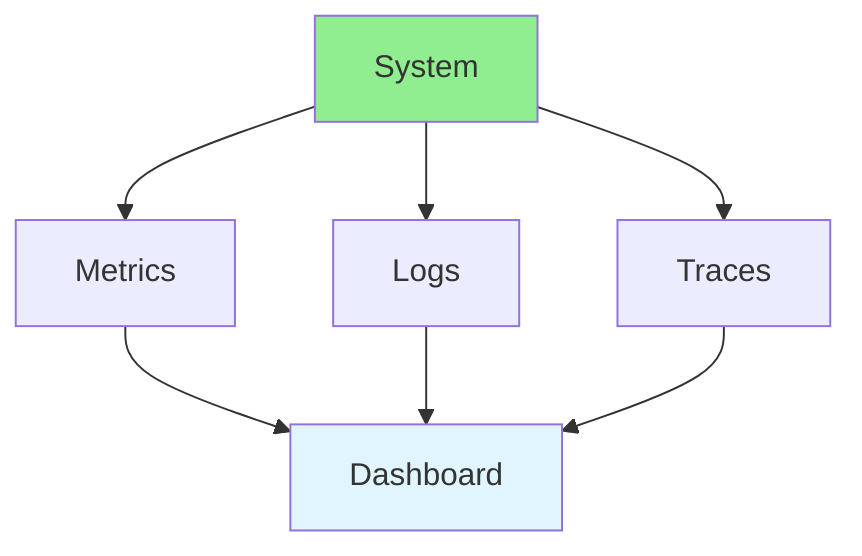

# 14.12 Monitoring & Observability / Giám sát & Quan sát

## Table of Contents / Mục lục
1. [Introduction / Giới thiệu](#introduction--giới-thiệu)
2. [Monitoring Tools / Công cụ giám sát](#monitoring-tools--công-cụ-giám-sát)
3. [Best Practices / Thực hành tốt nhất](#best-practices--thực-hành-tốt-nhất)
4. [Summary / Tóm tắt](#summary--tóm-tắt)

---

## Introduction / Giới thiệu

### Overview / Tổng quan

**English**: Monitoring and observability help understand system behavior. Learn to use metrics, logs, and traces for system insights.

**Vietnamese**: Giám sát và quan sát giúp hiểu hành vi hệ thống. Học cách sử dụng metrics, logs và traces cho insights hệ thống.

### Observability Stack / Stack Quan sát



---

## Monitoring Tools / Công cụ giám sát

### Example 1: Monitoring Setup / Ví dụ 1: Thiết lập giám sát

```typescript
// Monitoring setup / Thiết lập giám sát
import { PrometheusClient } from 'prometheus-client';

// Metrics / Metrics
const httpRequestDuration = new PrometheusClient.Histogram({
  name: 'http_request_duration_seconds',
  help: 'Duration of HTTP requests in seconds',
  labelNames: ['method', 'route', 'status']
});

// Logging / Logging
import winston from 'winston';

const logger = winston.createLogger({
  level: 'info',
  format: winston.format.json(),
  transports: [
    new winston.transports.File({ filename: 'error.log', level: 'error' }),
    new winston.transports.File({ filename: 'combined.log' })
  ]
});

// Tracing / Tracing
import { trace } from '@opentelemetry/api';

const tracer = trace.getTracer('my-service');

function handleRequest(req: any, res: any) {
  const span = tracer.startSpan('handleRequest');
  // Request handling / Xử lý request
  span.end();
}
```

---

## Best Practices / Thực hành tốt nhất

1. **Three pillars** - Metrics, logs, traces
2. **Alerting** - Set up alerts
3. **Dashboards** - Visualize data
4. **Retention** - Keep data appropriately
5. **Cost** - Monitor monitoring costs

---

## Summary / Tóm tắt

### Key Takeaways / Điểm chính

- **Metrics**: Quantitative measurements
- **Logs**: Event records
- **Traces**: Request flows
- **Tools**: Prometheus, Grafana, ELK

### Next Steps / Bước tiếp theo

- [14.13 Security Advanced](./14.13_Security_Advanced.md) - Next: Security Advanced

---

**Last Updated / Cập nhật lần cuối**: 2024


