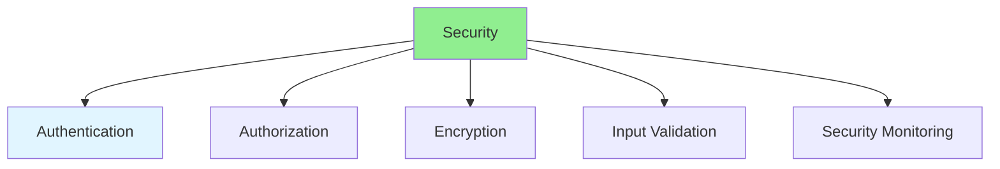
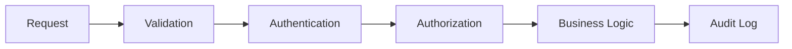

# 14.13 Security Advanced / Bảo mật nâng cao

## Table of Contents / Mục lục
1. [Introduction / Giới thiệu](#introduction--giới-thiệu)
2. [Security Practices / Thực hành bảo mật](#security-practices--thực-hành-bảo-mật)
3. [Defense Layers / Các lớp phòng thủ](#defense-layers--các-lớp-phòng-thủ)
4. [Monitoring and Response / Giám sát và phản ứng](#monitoring-and-response--giám-sát-và-phản-ứng)
5. [Best Practices / Thực hành tốt nhất](#best-practices--thực-hành-tốt-nhất)
6. [Summary / Tóm tắt](#summary--tóm-tắt)

---

## Introduction / Giới thiệu

### Overview / Tổng quan

**English**: Advanced security protects applications from threats. Learn OWASP top 10, encryption, authentication, and security best practices.

**Vietnamese**: Bảo mật nâng cao bảo vệ ứng dụng khỏi mối đe dọa. Học OWASP top 10, mã hóa, xác thực và thực hành bảo mật tốt nhất.

### Security Layers / Lớp bảo mật



---

## Security Practices / Thực hành bảo mật

### Example 1: Security Implementation / Ví dụ 1: Triển khai bảo mật

```typescript
// Security practices / Thực hành bảo mật
import * as bcrypt from 'bcrypt';
import * as jwt from 'jsonwebtoken';

// Password hashing / Hash mật khẩu
async function hashPassword(password: string): Promise<string> {
  return await bcrypt.hash(password, 10);
}

// JWT token / Token JWT
function generateToken(userId: string): string {
  return jwt.sign({ userId }, process.env.JWT_SECRET!, {
    expiresIn: '1h'
  });
}

// Input validation / Validation đầu vào
import { z } from 'zod';

const userSchema = z.object({
  email: z.string().email(),
  password: z.string().min(8)
});

function validateInput(data: any) {
  return userSchema.parse(data);
}
```

### Security Request Flow / Luồng request bảo mật



---

## Defense Layers / Các lớp phòng thủ

### What To Protect / Cần bảo vệ gì

- user credentials
- session and token handling
- sensitive data at rest and in transit
- admin-only actions
- file upload and external input paths

### Common Failure Areas / Khu vực thường lỗi

- weak password handling
- insecure token storage
- authorization gaps
- overexposed admin endpoints
- missing audit trails

---

## Monitoring and Response / Giám sát và phản ứng

### Good Security Signals / Tín hiệu bảo mật tốt

- repeated failed login attempts
- unusual token usage
- privilege escalation attempts
- unexpected admin actions
- anomalous request volume

### Example 2: Security Logging / Ví dụ 2: Ghi log bảo mật

```typescript
logger.warn('auth_failure', {
  email,
  ipAddress: req.ip,
  userAgent: req.headers['user-agent'],
});
```

---

## Best Practices / Thực hành tốt nhất

1. **OWASP Top 10** - Address common vulnerabilities
2. **Encryption** - Encrypt sensitive data
3. **Authentication** - Strong auth mechanisms
4. **Authorization** - Proper access control
5. **Input validation** - Validate all inputs
6. **Audit critical actions** - Sensitive operations should be traceable
7. **Layer defenses** - Never rely on one control only
8. **Monitor abuse patterns** - Security posture includes detection

---

## Summary / Tóm tắt

### Key Takeaways / Điểm chính

- **OWASP**: Address top vulnerabilities
- **Encryption**: Protect data
- **Auth**: Strong authentication
- **Validation**: Input validation
- **Defense**: Strong systems combine prevention, detection, and response
- **Visibility**: Security logging and monitoring are part of the design

### Next Steps / Bước tiếp theo

- [14.14 Performance Optimization](./14.14_Performance_Optimization.md) - Next: Performance Optimization

---

**Last Updated / Cập nhật lần cuối**: 2024

