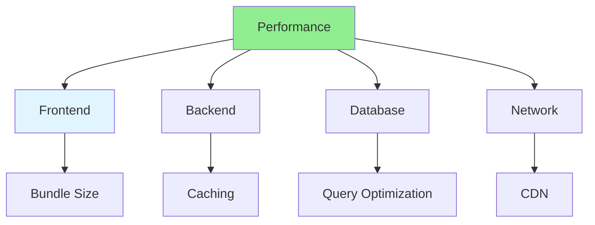

# 14.14 Performance Optimization / Tối ưu hiệu năng

## Table of Contents / Mục lục
1. [Introduction / Giới thiệu](#introduction--giới-thiệu)
2. [Optimization Techniques / Kỹ thuật tối ưu](#optimization-techniques--kỹ-thuật-tối-ưu)
3. [Best Practices / Thực hành tốt nhất](#best-practices--thực-hành-tốt-nhất)
4. [Summary / Tóm tắt](#summary--tóm-tắt)

---

## Introduction / Giới thiệu

### Overview / Tổng quan

**English**: Performance optimization improves application speed and efficiency. Learn advanced techniques for optimizing applications.

**Vietnamese**: Tối ưu hiệu năng cải thiện tốc độ và hiệu quả ứng dụng. Học kỹ thuật nâng cao để tối ưu ứng dụng.

### Performance Optimization Areas / Lĩnh vực tối ưu hiệu năng



---

## Optimization Techniques / Kỹ thuật tối ưu

### Example 1: Performance Optimization / Ví dụ 1: Tối ưu hiệu năng

```typescript
// Performance optimization / Tối ưu hiệu năng
// Code splitting / Chia nhỏ code
import { lazy, Suspense } from 'react';

const LazyComponent = lazy(() => import('./HeavyComponent'));

function App() {
  return (
    <Suspense fallback={<div>Loading...</div>}>
      <LazyComponent />
    </Suspense>
  );
}

// Memoization / Ghi nhớ
import { useMemo } from 'react';

function ExpensiveComponent({ data }: { data: any[] }) {
  const processed = useMemo(() => {
    return data.map(item => expensiveOperation(item));
  }, [data]);
  
  return <div>{processed}</div>;
}

// Database optimization / Tối ưu database
async function optimizedQuery() {
  return await prisma.user.findMany({
    select: { id: true, name: true }, // Only select needed fields / Chỉ chọn fields cần thiết
    where: { active: true },
    take: 100,
    orderBy: { createdAt: 'desc' }
  });
}
```

---

## Best Practices / Thực hành tốt nhất

1. **Measure first** - Profile before optimizing
2. **Frontend** - Code splitting, lazy loading
3. **Backend** - Caching, query optimization
4. **Database** - Indexes, query optimization
5. **Network** - CDN, compression

---

## Summary / Tóm tắt

### Key Takeaways / Điểm chính

- **Measurement**: Profile first
- **Frontend**: Bundle size, lazy loading
- **Backend**: Caching, optimization
- **Database**: Indexes, queries

### Next Steps / Bước tiếp theo

- [14.15 Scalability Patterns](./14.15_Scalability_Patterns.md) - Next: Scalability Patterns

---

**Last Updated / Cập nhật lần cuối**: 2024


