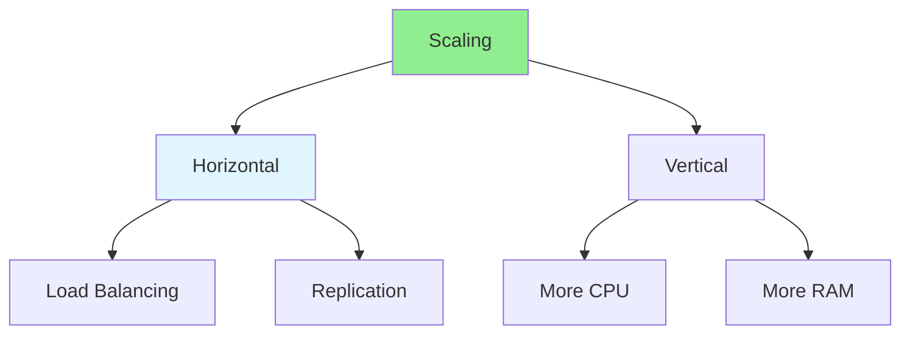

# 14.15 Scalability Patterns / Mẫu khả năng mở rộng

## Table of Contents / Mục lục
1. [Introduction / Giới thiệu](#introduction--giới-thiệu)
2. [Scaling Strategies / Chiến lược mở rộng](#scaling-strategies--chiến-lược-mở-rộng)
3. [Best Practices / Thực hành tốt nhất](#best-practices--thực-hành-tốt-nhất)
4. [Summary / Tóm tắt](#summary--tóm-tắt)

---

## Introduction / Giới thiệu

### Overview / Tổng quan

**English**: Scalability patterns enable applications to handle growth. Learn horizontal and vertical scaling, load balancing, and caching strategies.

**Vietnamese**: Mẫu khả năng mở rộng cho phép ứng dụng xử lý tăng trưởng. Học horizontal và vertical scaling, load balancing và chiến lược caching.

### Scaling Patterns / Mẫu mở rộng



---

## Scaling Strategies / Chiến lược mở rộng

### Example 1: Scaling Patterns / Ví dụ 1: Mẫu mở rộng

```typescript
// Scaling patterns / Mẫu mở rộng
interface ScalingStrategy {
  type: 'horizontal' | 'vertical';
  method: string;
  benefits: string[];
}

const scalingStrategies: ScalingStrategy[] = [
  {
    type: 'horizontal',
    method: 'Add more servers',
    benefits: ['Better fault tolerance', 'Easier to scale', 'Cost effective']
  },
  {
    type: 'vertical',
    method: 'Upgrade server resources',
    benefits: ['Simpler architecture', 'No code changes', 'Limited scalability']
  }
];

// Load balancing / Cân bằng tải
class LoadBalancer {
  private servers: string[] = [];
  
  addServer(server: string): void {
    this.servers.push(server);
  }
  
  getServer(): string {
    // Round-robin / Round-robin
    const index = Math.floor(Math.random() * this.servers.length);
    return this.servers[index];
  }
}
```

---

## Best Practices / Thực hành tốt nhất

1. **Horizontal scaling** - Add more instances
2. **Load balancing** - Distribute load
3. **Caching** - Reduce database load
4. **Database scaling** - Read replicas, sharding
5. **CDN** - Distribute static content

---

## Summary / Tóm tắt

### Key Takeaways / Điểm chính

- **Horizontal**: Add more servers
- **Vertical**: Upgrade resources
- **Load balancing**: Distribute requests
- **Caching**: Reduce load

### Next Steps / Bước tiếp theo

- [14.16 Technology Trends](./14.16_Technology_Trends.md) - Next: Technology Trends

---

**Last Updated / Cập nhật lần cuối**: 2024


