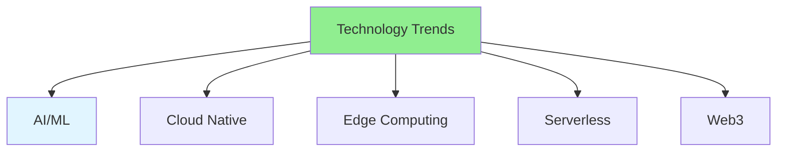

# 14.16 Technology Trends / Xu hướng công nghệ

## Table of Contents / Mục lục
1. [Introduction / Giới thiệu](#introduction--giới-thiệu)
2. [Current Trends / Xu hướng hiện tại](#current-trends--xu-hướng-hiện-tại)
3. [Best Practices / Thực hành tốt nhất](#best-practices--thực-hành-tốt-nhất)
4. [Summary / Tóm tắt](#summary--tóm-tắt)

---

## Introduction / Giới thiệu

### Overview / Tổng quan

**English**: Technology trends shape the future of development. Learn about emerging technologies and how to stay current.

**Vietnamese**: Xu hướng công nghệ định hình tương lai phát triển. Học về công nghệ mới nổi và cách cập nhật.

### Technology Trends / Xu hướng công nghệ



---

## Current Trends / Xu hướng hiện tại

### Example 1: Technology Trends / Ví dụ 1: Xu hướng công nghệ

```typescript
// Technology trends / Xu hướng công nghệ
const technologyTrends = {
  ai: {
    description: 'AI-assisted development',
    examples: ['GitHub Copilot', 'ChatGPT', 'Code generation'],
    impact: 'Faster development, better code quality'
  },
  cloudNative: {
    description: 'Cloud-native applications',
    examples: ['Kubernetes', 'Microservices', 'Containers'],
    impact: 'Scalability and flexibility'
  },
  serverless: {
    description: 'Serverless architecture',
    examples: ['AWS Lambda', 'Vercel', 'Cloud Functions'],
    impact: 'Cost efficiency, auto-scaling'
  },
  edge: {
    description: 'Edge computing',
    examples: ['CDN', 'Edge functions', 'IoT'],
    impact: 'Lower latency, better performance'
  }
};
```

---

## Best Practices / Thực hành tốt nhất

1. **Stay informed** - Follow tech news
2. **Experiment** - Try new technologies
3. **Evaluate** - Assess before adopting
4. **Learn continuously** - Keep learning
5. **Community** - Engage with tech community

---

## Summary / Tóm tắt

### Key Takeaways / Điểm chính

- **AI/ML**: AI-assisted development
- **Cloud Native**: Cloud-first approach
- **Serverless**: Function-based architecture
- **Edge**: Edge computing

### Next Steps / Bước tiếp theo

- Complete Group 14: Advanced Technologies ✅
- Move to [Group 15: Soft Skills](../Group-15-Soft-Skills/) - Coming next

---

**Last Updated / Cập nhật lần cuối**: 2024

