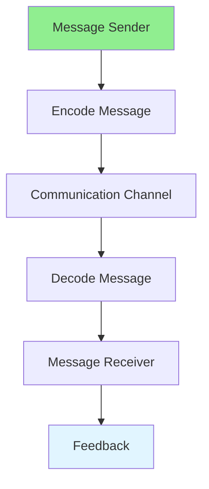

# 15.01 Communication Skills / Kỹ năng giao tiếp

## Table of Contents / Mục lục
1. [Introduction / Giới thiệu](#introduction--giới-thiệu)
2. [Communication Types / Loại giao tiếp](#communication-types--loại-giao-tiếp)
3. [Best Practices / Thực hành tốt nhất](#best-practices--thực-hành-tốt-nhất)
4. [Summary / Tóm tắt](#summary--tóm-tắt)

---

## Introduction / Giới thiệu

### Overview / Tổng quan

**English**: Effective communication is essential for developers. Learn to communicate clearly with team members, stakeholders, and clients.

**Vietnamese**: Giao tiếp hiệu quả rất quan trọng cho developers. Học cách giao tiếp rõ ràng với thành viên nhóm, stakeholders và khách hàng.

### Communication Flow / Luồng giao tiếp



---

## Communication Types / Loại giao tiếp

### Example 1: Communication Methods / Ví dụ 1: Phương pháp giao tiếp

```typescript
// Communication methods / Phương pháp giao tiếp
interface Communication {
  type: 'verbal' | 'written' | 'visual';
  channel: string;
  audience: string;
  message: string;
}

// Effective communication / Giao tiếp hiệu quả
function communicate(
  type: Communication['type'],
  message: string,
  audience: string
): string {
  switch (type) {
    case 'verbal':
      return `Speaking to ${audience}: ${message}`;
    case 'written':
      return `Writing to ${audience}: ${message}`;
    case 'visual':
      return `Showing to ${audience}: ${message}`;
  }
}
```

---

## Best Practices / Thực hành tốt nhất

1. **Be clear** - Use simple language
2. **Listen actively** - Understand others
3. **Ask questions** - Clarify when needed
4. **Be concise** - Get to the point
5. **Show empathy** - Understand perspectives

---

## Summary / Tóm tắt

### Key Takeaways / Điểm chính

- **Clarity**: Clear and simple
- **Listening**: Active listening
- **Questions**: Ask for clarification
- **Empathy**: Understand others

### Next Steps / Bước tiếp theo

- [15.02 Problem Solving](./15.02_Problem_Solving.md) - Next: Problem Solving

---

**Last Updated / Cập nhật lần cuối**: 2024

