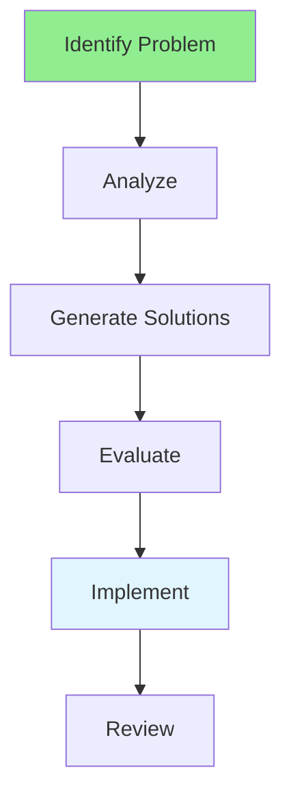

# 15.02 Problem Solving / Giải quyết vấn đề

## Table of Contents / Mục lục
1. [Introduction / Giới thiệu](#introduction--giới-thiệu)
2. [Problem-Solving Process / Quy trình giải quyết vấn đề](#problem-solving-process--quy-trình-giải-quyết-vấn-đề)
3. [Best Practices / Thực hành tốt nhất](#best-practices--thực-hành-tốt-nhất)
4. [Summary / Tóm tắt](#summary--tóm-tắt)

---

## Introduction / Giới thiệu

### Overview / Tổng quan

**English**: Problem-solving is a core developer skill. Learn systematic approaches to identify, analyze, and solve problems effectively.

**Vietnamese**: Giải quyết vấn đề là kỹ năng cốt lõi của developer. Học cách tiếp cận có hệ thống để xác định, phân tích và giải quyết vấn đề hiệu quả.

### Problem-Solving Flow / Luồng giải quyết vấn đề



---

## Problem-Solving Process / Quy trình giải quyết vấn đề

### Example 1: Problem-Solving Framework / Ví dụ 1: Khung giải quyết vấn đề

```typescript
// Problem-solving framework / Khung giải quyết vấn đề
interface Problem {
  description: string;
  symptoms: string[];
  rootCause?: string;
  solutions: Solution[];
}

interface Solution {
  approach: string;
  pros: string[];
  cons: string[];
  feasibility: 'high' | 'medium' | 'low';
}

// Solve problem / Giải quyết vấn đề
function solveProblem(problem: Problem): Solution {
  // Analyze / Phân tích
  const rootCause = analyzeRootCause(problem);
  
  // Generate solutions / Tạo giải pháp
  const solutions = generateSolutions(rootCause);
  
  // Evaluate / Đánh giá
  return evaluateSolutions(solutions);
}
```

---

## Best Practices / Thực hành tốt nhất

1. **Define problem** - Understand clearly
2. **Root cause** - Find root cause
3. **Multiple solutions** - Consider alternatives
4. **Evaluate** - Assess solutions
5. **Implement** - Execute best solution

---

## Summary / Tóm tắt

### Key Takeaways / Điểm chính

- **Process**: Identify, analyze, solve
- **Root cause**: Find underlying issue
- **Solutions**: Multiple approaches
- **Evaluation**: Assess before implementing

### Next Steps / Bước tiếp theo

- [15.03 Critical Thinking](./15.03_Critical_Thinking.md) - Next: Critical Thinking

---

**Last Updated / Cập nhật lần cuối**: 2024

