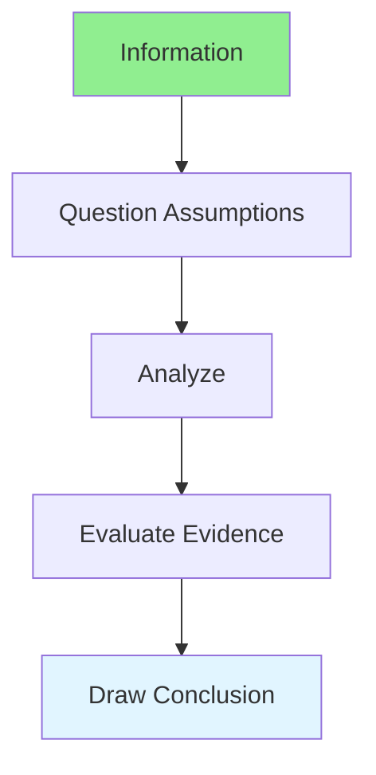

# 15.03 Critical Thinking / Tư duy phản biện

## Table of Contents / Mục lục
1. [Introduction / Giới thiệu](#introduction--giới-thiệu)
2. [Critical Thinking Process / Quy trình tư duy phản biện](#critical-thinking-process--quy-trình-tư-duy-phản-biện)
3. [Best Practices / Thực hành tốt nhất](#best-practices--thực-hành-tốt-nhất)
4. [Summary / Tóm tắt](#summary--tóm-tắt)

---

## Introduction / Giới thiệu

### Overview / Tổng quan

**English**: Critical thinking enables objective analysis and decision-making. Learn to evaluate information, question assumptions, and make informed decisions.

**Vietnamese**: Tư duy phản biện cho phép phân tích và ra quyết định khách quan. Học cách đánh giá thông tin, đặt câu hỏi giả định và ra quyết định có thông tin.

### Critical Thinking Flow / Luồng tư duy phản biện



---

## Critical Thinking Process / Quy trình tư duy phản biện

### Example 1: Critical Thinking Framework / Ví dụ 1: Khung tư duy phản biện

```typescript
// Critical thinking framework / Khung tư duy phản biện
interface CriticalAnalysis {
  question: string;
  assumptions: string[];
  evidence: Evidence[];
  conclusion: string;
}

interface Evidence {
  source: string;
  reliability: 'high' | 'medium' | 'low';
  relevance: 'high' | 'medium' | 'low';
}

// Critical analysis / Phân tích phản biện
function analyzeCritically(question: string): CriticalAnalysis {
  return {
    question,
    assumptions: identifyAssumptions(question),
    evidence: gatherEvidence(question),
    conclusion: drawConclusion(question)
  };
}
```

---

## Best Practices / Thực hành tốt nhất

1. **Question assumptions** - Don't accept blindly
2. **Gather evidence** - Collect relevant data
3. **Evaluate sources** - Assess reliability
4. **Consider alternatives** - Multiple perspectives
5. **Draw conclusions** - Based on evidence

---

## Summary / Tóm tắt

### Key Takeaways / Điểm chính

- **Questioning**: Challenge assumptions
- **Evidence**: Gather and evaluate
- **Analysis**: Objective analysis
- **Conclusion**: Evidence-based

### Next Steps / Bước tiếp theo

- [15.04 Time Management](./15.04_Time_Management.md) - Next: Time Management

---

**Last Updated / Cập nhật lần cuối**: 2024


