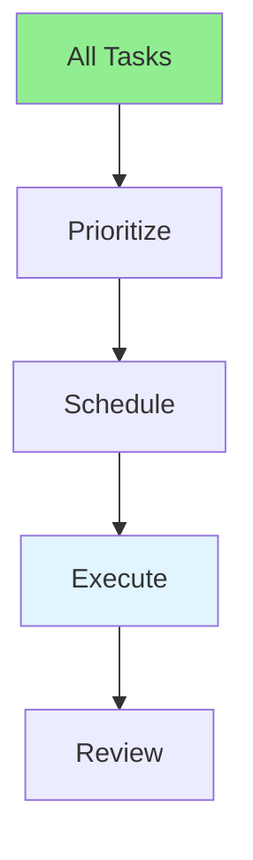

# 15.04 Time Management / Quản lý thời gian

## Table of Contents / Mục lục
1. [Introduction / Giới thiệu](#introduction--giới-thiệu)
2. [Time Management Techniques / Kỹ thuật quản lý thời gian](#time-management-techniques--kỹ-thuật-quản-lý-thời-gian)
3. [Best Practices / Thực hành tốt nhất](#best-practices--thực-hành-tốt-nhất)
4. [Summary / Tóm tắt](#summary--tóm-tắt)

---

## Introduction / Giới thiệu

### Overview / Tổng quan

**English**: Effective time management improves productivity. Learn techniques to prioritize tasks, manage deadlines, and maximize efficiency.

**Vietnamese**: Quản lý thời gian hiệu quả cải thiện năng suất. Học kỹ thuật để ưu tiên nhiệm vụ, quản lý deadline và tối đa hóa hiệu quả.

### Time Management Flow / Luồng quản lý thời gian



---

## Time Management Techniques / Kỹ thuật quản lý thời gian

### Example 1: Time Management / Ví dụ 1: Quản lý thời gian

```typescript
// Time management / Quản lý thời gian
interface TimeBlock {
  task: string;
  startTime: Date;
  endTime: Date;
  priority: 'high' | 'medium' | 'low';
}

// Time blocking / Chặn thời gian
function createTimeBlocks(tasks: Task[]): TimeBlock[] {
  const blocks: TimeBlock[] = [];
  let currentTime = new Date();
  
  tasks.sort((a, b) => (b.priority || 0) - (a.priority || 0));
  
  tasks.forEach(task => {
    const endTime = addHours(currentTime, task.estimatedHours);
    blocks.push({
      task: task.name,
      startTime: currentTime,
      endTime,
      priority: task.priority
    });
    currentTime = endTime;
  });
  
  return blocks;
}
```

---

## Best Practices / Thực hành tốt nhất

1. **Prioritize** - Focus on important tasks
2. **Time blocking** - Schedule time slots
3. **Avoid multitasking** - Focus on one task
4. **Take breaks** - Rest regularly
5. **Review** - Adjust schedule

---

## Summary / Tóm tắt

### Key Takeaways / Điểm chính

- **Prioritization**: Focus on important
- **Scheduling**: Time blocking
- **Focus**: Single tasking
- **Review**: Regular adjustment

### Next Steps / Bước tiếp theo

- [15.05 Stress Management](./15.05_Stress_Management.md) - Next: Stress Management

---

**Last Updated / Cập nhật lần cuối**: 2024


