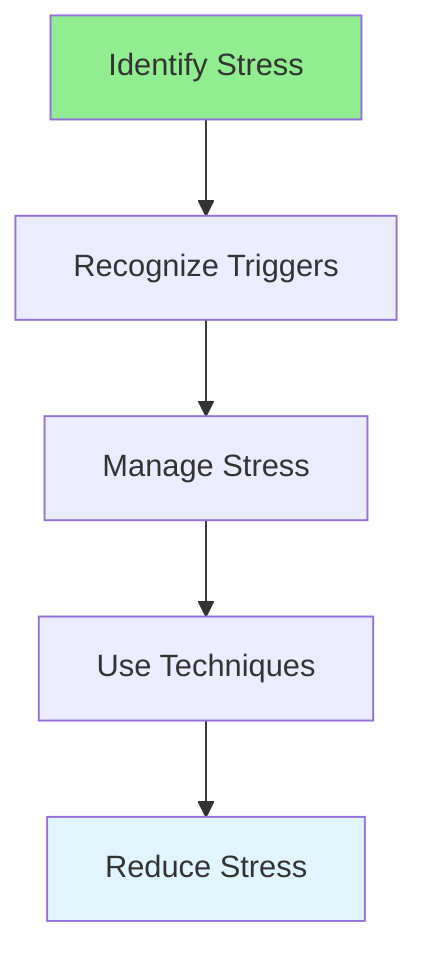

# 15.05 Stress Management / Quản lý căng thẳng

## Table of Contents / Mục lục
1. [Introduction / Giới thiệu](#introduction--giới-thiệu)
2. [Stress Management Techniques / Kỹ thuật quản lý căng thẳng](#stress-management-techniques--kỹ-thuật-quản-lý-căng-thẳng)
3. [Best Practices / Thực hành tốt nhất](#best-practices--thực-hành-tốt-nhất)
4. [Summary / Tóm tắt](#summary--tóm-tắt)

---

## Introduction / Giới thiệu

### Overview / Tổng quan

**English**: Managing stress is crucial for well-being and productivity. Learn techniques to identify, manage, and reduce stress.

**Vietnamese**: Quản lý căng thẳng rất quan trọng cho sức khỏe và năng suất. Học kỹ thuật để xác định, quản lý và giảm căng thẳng.

### Stress Management Flow / Luồng quản lý căng thẳng



---

## Stress Management Techniques / Kỹ thuật quản lý căng thẳng

### Example 1: Stress Management / Ví dụ 1: Quản lý căng thẳng

```typescript
// Stress management / Quản lý căng thẳng
interface StressTrigger {
  source: string;
  level: 'low' | 'medium' | 'high';
  copingStrategy: string;
}

const stressManagement = {
  techniques: [
    'Deep breathing',
    'Exercise',
    'Meditation',
    'Time management',
    'Break tasks into smaller pieces',
    'Take breaks',
    'Seek support'
  ],
  prevention: [
    'Maintain work-life balance',
    'Set realistic expectations',
    'Learn to say no',
    'Prioritize tasks',
    'Get enough sleep'
  ]
};
```

---

## Best Practices / Thực hành tốt nhất

1. **Identify triggers** - Know what causes stress
2. **Use techniques** - Breathing, exercise, breaks
3. **Prevent** - Manage workload
4. **Seek help** - Don't hesitate to ask
5. **Balance** - Maintain work-life balance

---

## Summary / Tóm tắt

### Key Takeaways / Điểm chính

- **Recognition**: Identify stress sources
- **Techniques**: Use coping strategies
- **Prevention**: Manage proactively
- **Balance**: Work-life balance

### Next Steps / Bước tiếp theo

- [15.06 Adaptability](./15.06_Adaptability.md) - Next: Adaptability

---

**Last Updated / Cập nhật lần cuối**: 2024

