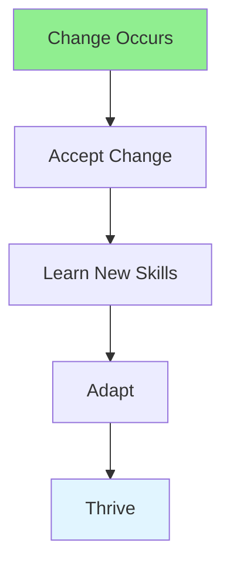

# 15.06 Adaptability / Khả năng thích ứng

## Table of Contents / Mục lục
1. [Introduction / Giới thiệu](#introduction--giới-thiệu)
2. [Adaptability Skills / Kỹ năng thích ứng](#adaptability-skills--kỹ-năng-thích-ứng)
3. [Best Practices / Thực hành tốt nhất](#best-practices--thực-hành-tốt-nhất)
4. [Summary / Tóm tắt](#summary--tóm-tắt)

---

## Introduction / Giới thiệu

### Overview / Tổng quan

**English**: Adaptability helps navigate change effectively. Learn to embrace change, learn new technologies, and adjust to new situations.

**Vietnamese**: Khả năng thích ứng giúp điều hướng thay đổi hiệu quả. Học cách chấp nhận thay đổi, học công nghệ mới và điều chỉnh tình huống mới.

### Adaptability Flow / Luồng thích ứng



---

## Adaptability Skills / Kỹ năng thích ứng

### Example 1: Adaptability Framework / Ví dụ 1: Khung thích ứng

```typescript
// Adaptability / Khả năng thích ứng
interface AdaptabilitySkills {
  learning: 'Quick to learn new technologies';
  flexibility: 'Open to change';
  resilience: 'Bounce back from setbacks';
  problemSolving: 'Find solutions in new situations';
}

// Adapt to change / Thích ứng với thay đổi
function adaptToChange(change: Change): Adaptation {
  return {
    recognize: 'Acknowledge change',
    learn: 'Acquire new skills',
    adjust: 'Modify approach',
    succeed: 'Thrive in new environment'
  };
}
```

---

## Best Practices / Thực hành tốt nhất

1. **Embrace change** - Welcome new challenges
2. **Learn continuously** - Keep learning
3. **Stay flexible** - Be open-minded
4. **Build resilience** - Handle setbacks
5. **Positive attitude** - See opportunities

---

## Summary / Tóm tắt

### Key Takeaways / Điểm chính

- **Change**: Embrace change
- **Learning**: Continuous learning
- **Flexibility**: Open-minded
- **Resilience**: Handle setbacks

### Next Steps / Bước tiếp theo

- [15.07 Leadership](./15.07_Leadership.md) - Next: Leadership

---

**Last Updated / Cập nhật lần cuối**: 2024


