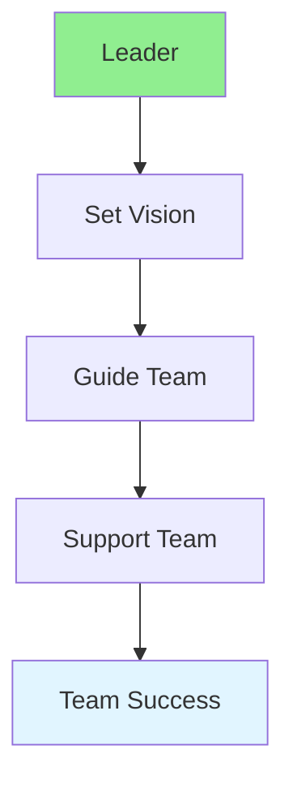

# 15.07 Leadership / Lãnh đạo

## Table of Contents / Mục lục
1. [Introduction / Giới thiệu](#introduction--giới-thiệu)
2. [Leadership Styles / Phong cách lãnh đạo](#leadership-styles--phong-cách-lãnh-đạo)
3. [Best Practices / Thực hành tốt nhất](#best-practices--thực-hành-tốt-nhất)
4. [Summary / Tóm tắt](#summary--tóm-tắt)

---

## Introduction / Giới thiệu

### Overview / Tổng quan

**English**: Leadership skills help guide teams and projects. Learn to lead by example, inspire others, and make effective decisions.

**Vietnamese**: Kỹ năng lãnh đạo giúp hướng dẫn nhóm và dự án. Học cách lãnh đạo bằng ví dụ, truyền cảm hứng và ra quyết định hiệu quả.

### Leadership Flow / Luồng lãnh đạo



---

## Leadership Styles / Phong cách lãnh đạo

### Example 1: Leadership Styles / Ví dụ 1: Phong cách lãnh đạo

```typescript
// Leadership styles / Phong cách lãnh đạo
enum LeadershipStyle {
  DEMOCRATIC = 'democratic', // Team input / Đầu vào nhóm
  AUTOCRATIC = 'autocratic', // Leader decides / Lãnh đạo quyết định
  TRANSFORMATIONAL = 'transformational', // Inspire change / Truyền cảm hứng thay đổi
  SERVANT = 'servant' // Serve team / Phục vụ nhóm
}

// Leadership approach / Cách tiếp cận lãnh đạo
function leadTeam(
  style: LeadershipStyle,
  situation: string
): string {
  switch (style) {
    case LeadershipStyle.DEMOCRATIC:
      return 'Gather team input before deciding';
    case LeadershipStyle.AUTOCRATIC:
      return 'Make decision quickly';
    case LeadershipStyle.TRANSFORMATIONAL:
      return 'Inspire team to achieve vision';
    case LeadershipStyle.SERVANT:
      return 'Support team to succeed';
  }
}
```

---

## Best Practices / Thực hành tốt nhất

1. **Lead by example** - Model desired behavior
2. **Communicate clearly** - Share vision and goals
3. **Empower team** - Give autonomy
4. **Support growth** - Help team develop
5. **Make decisions** - Decisive when needed

---

## Summary / Tóm tắt

### Key Takeaways / Điểm chính

- **Styles**: Different approaches
- **Vision**: Clear direction
- **Support**: Help team succeed
- **Decisions**: Make timely decisions

### Next Steps / Bước tiếp theo

- [15.08 Presentation Skills](./15.08_Presentation_Skills.md) - Next: Presentation Skills

---

**Last Updated / Cập nhật lần cuối**: 2024

