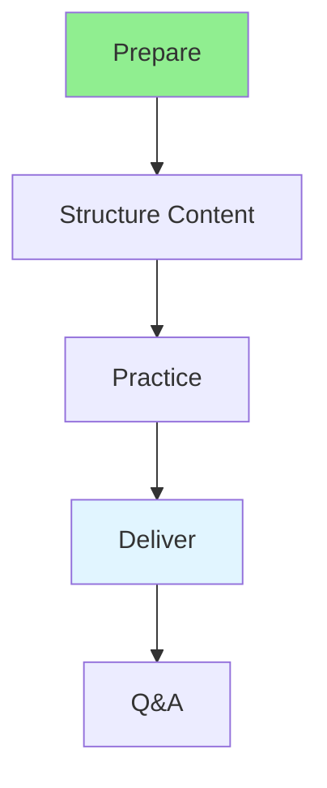

# 15.08 Presentation Skills / Kỹ năng trình bày

## Table of Contents / Mục lục
1. [Introduction / Giới thiệu](#introduction--giới-thiệu)
2. [Presentation Structure / Cấu trúc trình bày](#presentation-structure--cấu-trúc-trình-bày)
3. [Best Practices / Thực hành tốt nhất](#best-practices--thực-hành-tốt-nhất)
4. [Summary / Tóm tắt](#summary--tóm-tắt)

---

## Introduction / Giới thiệu

### Overview / Tổng quan

**English**: Effective presentation skills help communicate ideas clearly. Learn to structure presentations, engage audiences, and deliver confidently.

**Vietnamese**: Kỹ năng trình bày hiệu quả giúp truyền đạt ý tưởng rõ ràng. Học cách cấu trúc trình bày, thu hút khán giả và trình bày tự tin.

### Presentation Flow / Luồng trình bày



---

## Presentation Structure / Cấu trúc trình bày

### Example 1: Presentation Template / Ví dụ 1: Mẫu trình bày

```typescript
// Presentation structure / Cấu trúc trình bày
interface Presentation {
  title: string;
  introduction: string;
  mainPoints: string[];
  conclusion: string;
  qa: boolean;
}

// Create presentation / Tạo trình bày
function createPresentation(topic: string): Presentation {
  return {
    title: topic,
    introduction: `Introduction to ${topic}`,
    mainPoints: [
      'Point 1: Overview',
      'Point 2: Key concepts',
      'Point 3: Examples',
      'Point 4: Best practices'
    ],
    conclusion: `Summary and next steps`,
    qa: true
  };
}
```

---

## Best Practices / Thực hành tốt nhất

1. **Know audience** - Tailor to audience
2. **Structure clearly** - Introduction, body, conclusion
3. **Practice** - Rehearse presentation
4. **Engage** - Interact with audience
5. **Visual aids** - Use slides effectively

---

## Summary / Tóm tắt

### Key Takeaways / Điểm chính

- **Structure**: Clear organization
- **Practice**: Rehearse thoroughly
- **Engagement**: Interact with audience
- **Confidence**: Deliver confidently

### Next Steps / Bước tiếp theo

- [15.09 Networking](./15.09_Networking.md) - Next: Networking

---

**Last Updated / Cập nhật lần cuối**: 2024

