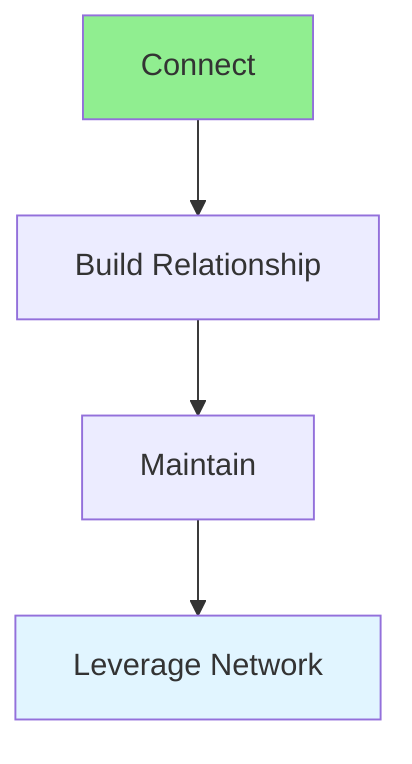

# 15.09 Networking / Kết nối mạng lưới

## Table of Contents / Mục lục
1. [Introduction / Giới thiệu](#introduction--giới-thiệu)
2. [Networking Strategies / Chiến lược kết nối](#networking-strategies--chiến-lược-kết-nối)
3. [Best Practices / Thực hành tốt nhất](#best-practices--thực-hành-tốt-nhất)
4. [Summary / Tóm tắt](#summary--tóm-tắt)

---

## Introduction / Giới thiệu

### Overview / Tổng quan

**English**: Networking builds professional relationships. Learn to connect with others, maintain relationships, and leverage your network.

**Vietnamese**: Kết nối mạng lưới xây dựng mối quan hệ chuyên nghiệp. Học cách kết nối với người khác, duy trì mối quan hệ và tận dụng mạng lưới.

### Networking Flow / Luồng kết nối



---

## Networking Strategies / Chiến lược kết nối

### Example 1: Networking / Ví dụ 1: Kết nối

```typescript
// Networking / Kết nối
interface NetworkContact {
  name: string;
  role: string;
  company: string;
  connectionDate: Date;
  lastContact: Date;
  notes: string;
}

// Maintain network / Duy trì mạng lưới
class NetworkManager {
  private contacts: NetworkContact[] = [];
  
  addContact(contact: NetworkContact): void {
    this.contacts.push(contact);
  }
  
  // Follow up / Theo dõi
  followUp(contactName: string): void {
    const contact = this.contacts.find(c => c.name === contactName);
    if (contact) {
      contact.lastContact = new Date();
    }
  }
}
```

---

## Best Practices / Thực hành tốt nhất

1. **Be genuine** - Authentic connections
2. **Give value** - Help others
3. **Follow up** - Maintain relationships
4. **Online and offline** - Use both channels
5. **Reciprocity** - Mutual benefit

---

## Summary / Tóm tắt

### Key Takeaways / Điểm chính

- **Genuine**: Authentic connections
- **Value**: Provide value
- **Maintenance**: Regular follow-up
- **Reciprocity**: Mutual benefit

### Next Steps / Bước tiếp theo

- [15.10 Professional Development](./15.10_Professional_Development.md) - Next: Professional Development

---

**Last Updated / Cập nhật lần cuối**: 2024


