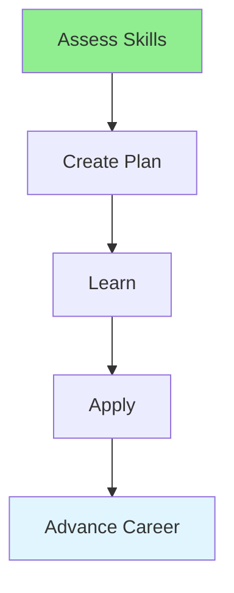

# 15.10 Professional Development / Phát triển chuyên nghiệp

## Table of Contents / Mục lục
1. [Introduction / Giới thiệu](#introduction--giới-thiệu)
2. [Development Areas / Lĩnh vực phát triển](#development-areas--lĩnh-vực-phát-triển)
3. [Best Practices / Thực hành tốt nhất](#best-practices--thực-hành-tốt-nhất)
4. [Summary / Tóm tắt](#summary--tóm-tắt)

---

## Introduction / Giới thiệu

### Overview / Tổng quan

**English**: Professional development enhances career growth. Learn to identify development areas, create learning plans, and advance your career.

**Vietnamese**: Phát triển chuyên nghiệp tăng cường phát triển sự nghiệp. Học cách xác định lĩnh vực phát triển, tạo kế hoạch học tập và thăng tiến sự nghiệp.

### Professional Development Flow / Luồng phát triển chuyên nghiệp



---

## Development Areas / Lĩnh vực phát triển

### Example 1: Professional Development / Ví dụ 1: Phát triển chuyên nghiệp

```typescript
// Professional development / Phát triển chuyên nghiệp
interface DevelopmentPlan {
  technical: string[];
  soft: string[];
  goals: string[];
  timeline: Date;
}

// Create development plan / Tạo kế hoạch phát triển
function createDevelopmentPlan(): DevelopmentPlan {
  return {
    technical: [
      'Learn TypeScript',
      'Master React hooks',
      'Understand microservices'
    ],
    soft: [
      'Improve communication',
      'Develop leadership',
      'Enhance problem-solving'
    ],
    goals: [
      'Senior developer in 2 years',
      'Lead a project team',
      'Contribute to open source'
    ],
    timeline: new Date('2025-12-31')
  };
}
```

---

## Best Practices / Thực hành tốt nhất

1. **Assess regularly** - Evaluate skills
2. **Set goals** - Clear objectives
3. **Learn continuously** - Keep learning
4. **Apply skills** - Practice in work
5. **Track progress** - Monitor development

---

## Summary / Tóm tắt

### Key Takeaways / Điểm chính

- **Assessment**: Regular skill evaluation
- **Planning**: Development roadmap
- **Learning**: Continuous improvement
- **Application**: Practice skills

### Next Steps / Bước tiếp theo

- [15.11 Learning Agility](./15.11_Learning_Agility.md) - Next: Learning Agility

---

**Last Updated / Cập nhật lần cuối**: 2024

