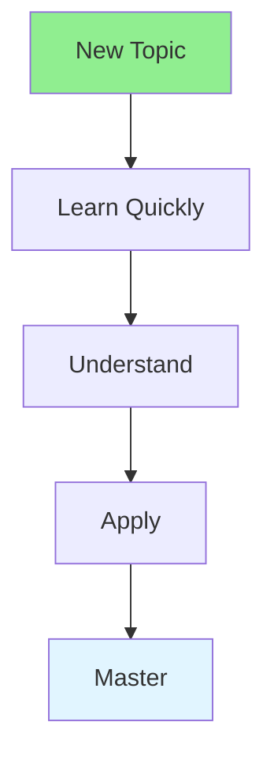

# 15.11 Learning Agility / Khả năng học nhanh

## Table of Contents / Mục lục
1. [Introduction / Giới thiệu](#introduction--giới-thiệu)
2. [Learning Techniques / Kỹ thuật học tập](#learning-techniques--kỹ-thuật-học-tập)
3. [Best Practices / Thực hành tốt nhất](#best-practices--thực-hành-tốt-nhất)
4. [Summary / Tóm tắt](#summary--tóm-tắt)

---

## Introduction / Giới thiệu

### Overview / Tổng quan

**English**: Learning agility enables quick adaptation to new situations. Learn techniques to learn faster and apply knowledge effectively.

**Vietnamese**: Khả năng học nhanh cho phép thích ứng nhanh với tình huống mới. Học kỹ thuật để học nhanh hơn và áp dụng kiến thức hiệu quả.

### Learning Agility Flow / Luồng khả năng học nhanh



---

## Learning Techniques / Kỹ thuật học tập

### Example 1: Learning Agility / Ví dụ 1: Khả năng học nhanh

```typescript
// Learning agility / Khả năng học nhanh
interface LearningMethod {
  technique: string;
  description: string;
  effectiveness: 'high' | 'medium' | 'low';
}

const learningMethods: LearningMethod[] = [
  {
    technique: 'Active learning',
    description: 'Practice while learning',
    effectiveness: 'high'
  },
  {
    technique: 'Spaced repetition',
    description: 'Review at intervals',
    effectiveness: 'high'
  },
  {
    technique: 'Teaching others',
    description: 'Explain to reinforce',
    effectiveness: 'high'
  }
];

// Learn quickly / Học nhanh
function learnQuickly(topic: string): string {
  return `Use active learning, practice immediately, teach others about ${topic}`;
}
```

---

## Best Practices / Thực hành tốt nhất

1. **Active learning** - Practice while learning
2. **Spaced repetition** - Review regularly
3. **Teach others** - Explain concepts
4. **Apply immediately** - Use new knowledge
5. **Reflect** - Think about learning

---

## Summary / Tóm tắt

### Key Takeaways / Điểm chính

- **Active**: Practice while learning
- **Repetition**: Spaced review
- **Teaching**: Explain to others
- **Application**: Use immediately

### Next Steps / Bước tiếp theo

- [15.12 Emotional Intelligence](./15.12_Emotional_Intelligence.md) - Next: Emotional Intelligence

---

**Last Updated / Cập nhật lần cuối**: 2024


