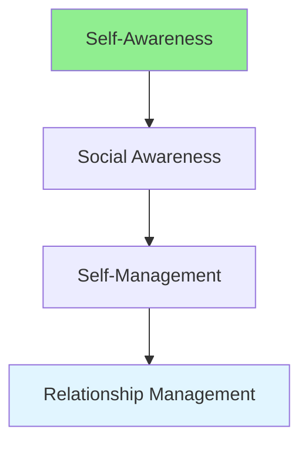

# 15.12 Emotional Intelligence / Trí tuệ cảm xúc

## Table of Contents / Mục lục
1. [Introduction / Giới thiệu](#introduction--giới-thiệu)
2. [EI Components / Thành phần EI](#ei-components--thành-phần-ei)
3. [Best Practices / Thực hành tốt nhất](#best-practices--thực-hành-tốt-nhất)
4. [Summary / Tóm tắt](#summary--tóm-tắt)

---

## Introduction / Giới thiệu

### Overview / Tổng quan

**English**: Emotional intelligence helps understand and manage emotions. Learn to recognize emotions, empathize, and build better relationships.

**Vietnamese**: Trí tuệ cảm xúc giúp hiểu và quản lý cảm xúc. Học cách nhận biết cảm xúc, đồng cảm và xây dựng mối quan hệ tốt hơn.

### Emotional Intelligence Flow / Luồng trí tuệ cảm xúc



---

## EI Components / Thành phần EI

### Example 1: Emotional Intelligence / Ví dụ 1: Trí tuệ cảm xúc

```typescript
// Emotional intelligence / Trí tuệ cảm xúc
interface EmotionalIntelligence {
  selfAwareness: 'Recognize own emotions';
  selfManagement: 'Manage own emotions';
  socialAwareness: 'Understand others\' emotions';
  relationshipManagement: 'Manage relationships';
}

// Develop EI / Phát triển EI
function developEmotionalIntelligence(): EmotionalIntelligence {
  return {
    selfAwareness: 'Reflect on emotions regularly',
    selfManagement: 'Practice emotional regulation',
    socialAwareness: 'Observe and understand others',
    relationshipManagement: 'Build positive relationships'
  };
}
```

---

## Best Practices / Thực hành tốt nhất

1. **Self-awareness** - Recognize your emotions
2. **Self-management** - Control reactions
3. **Empathy** - Understand others
4. **Social skills** - Build relationships
5. **Practice** - Develop EI skills

---

## Summary / Tóm tắt

### Key Takeaways / Điểm chính

- **Self-awareness**: Know your emotions
- **Self-management**: Control emotions
- **Empathy**: Understand others
- **Relationships**: Build connections

### Next Steps / Bước tiếp theo

- [15.13 Collaboration](./15.13_Collaboration.md) - Next: Collaboration

---

**Last Updated / Cập nhật lần cuối**: 2024


