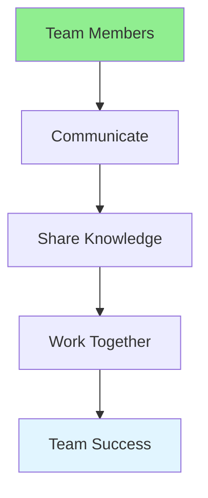

# 15.13 Collaboration / Cộng tác

## Table of Contents / Mục lục
1. [Introduction / Giới thiệu](#introduction--giới-thiệu)
2. [Collaboration Skills / Kỹ năng cộng tác](#collaboration-skills--kỹ-năng-cộng-tác)
3. [Best Practices / Thực hành tốt nhất](#best-practices--thực-hành-tốt-nhất)
4. [Summary / Tóm tắt](#summary--tóm-tắt)

---

## Introduction / Giới thiệu

### Overview / Tổng quan

**English**: Effective collaboration improves team outcomes. Learn to work with others, share knowledge, and contribute to team success.

**Vietnamese**: Cộng tác hiệu quả cải thiện kết quả nhóm. Học cách làm việc với người khác, chia sẻ kiến thức và đóng góp vào thành công nhóm.

### Collaboration Flow / Luồng cộng tác



---

## Collaboration Skills / Kỹ năng cộng tác

### Example 1: Collaboration / Ví dụ 1: Cộng tác

```typescript
// Collaboration / Cộng tác
interface Collaboration {
  communication: 'Clear and open';
  knowledgeSharing: 'Share expertise';
  conflictResolution: 'Resolve disagreements';
  mutualSupport: 'Help each other';
}

// Collaborate effectively / Cộng tác hiệu quả
function collaborate(
  team: TeamMember[],
  goal: string
): CollaborationResult {
  return {
    communication: 'Regular updates and discussions',
    knowledgeSharing: 'Share code, patterns, and solutions',
    conflictResolution: 'Address issues constructively',
    mutualSupport: 'Help when needed',
    outcome: 'Achieve team goal'
  };
}
```

---

## Best Practices / Thực hành tốt nhất

1. **Communicate openly** - Share information
2. **Share knowledge** - Help others learn
3. **Respect differences** - Value diverse perspectives
4. **Support team** - Help when needed
5. **Celebrate success** - Recognize achievements

---

## Summary / Tóm tắt

### Key Takeaways / Điểm chính

- **Communication**: Open and clear
- **Sharing**: Knowledge and expertise
- **Support**: Help team members
- **Success**: Team achievements

### Next Steps / Bước tiếp theo

- [15.14 Feedback](./15.14_Feedback.md) - Next: Feedback

---

**Last Updated / Cập nhật lần cuối**: 2024


