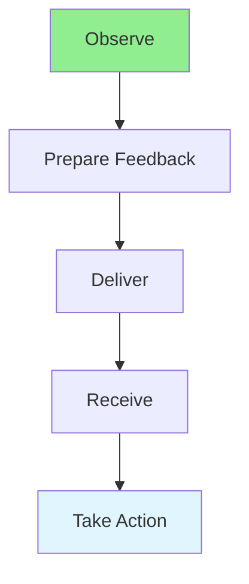

# 15.14 Feedback / Phản hồi

## Table of Contents / Mục lục
1. [Introduction / Giới thiệu](#introduction--giới-thiệu)
2. [Giving Feedback / Đưa ra phản hồi](#giving-feedback--đưa-ra-phản-hồi)
3. [Receiving Feedback / Nhận phản hồi](#receiving-feedback--nhận-phản-hồi)
4. [Best Practices / Thực hành tốt nhất](#best-practices--thực-hành-tốt-nhất)
5. [Summary / Tóm tắt](#summary--tóm-tắt)

---

## Introduction / Giới thiệu

### Overview / Tổng quan

**English**: Effective feedback improves performance and relationships. Learn to give constructive feedback and receive feedback gracefully.

**Vietnamese**: Phản hồi hiệu quả cải thiện hiệu suất và mối quan hệ. Học cách đưa ra phản hồi xây dựng và nhận phản hồi một cách lịch sự.

### Feedback Flow / Luồng phản hồi



---

## Giving Feedback / Đưa ra phản hồi

### Example 1: Feedback Framework / Ví dụ 1: Khung phản hồi

```typescript
// Feedback framework / Khung phản hồi
interface Feedback {
  situation: string;
  behavior: string;
  impact: string;
  suggestion: string;
}

// Give feedback / Đưa ra phản hồi
function giveFeedback(
  situation: string,
  behavior: string,
  impact: string
): Feedback {
  return {
    situation: `In ${situation}`,
    behavior: `When you ${behavior}`,
    impact: `It ${impact}`,
    suggestion: 'Consider...'
  };
}

// Example / Ví dụ
const feedback = giveFeedback(
  'the code review',
  'provided detailed comments',
  'helped improve code quality significantly'
);
```

---

## Receiving Feedback / Nhận phản hồi

### Example 2: Receiving Feedback / Ví dụ 2: Nhận phản hồi

```typescript
// Receiving feedback / Nhận phản hồi
function receiveFeedback(feedback: Feedback): string {
  return `
    Thank you for the feedback.
    I understand: ${feedback.impact}
    I will: ${feedback.suggestion}
  `;
}
```

---

## Best Practices / Thực hành tốt nhất

1. **Be specific** - Give concrete examples
2. **Be timely** - Provide soon after event
3. **Be constructive** - Focus on improvement
4. **Listen actively** - When receiving
5. **Take action** - Act on feedback

---

## Summary / Tóm tắt

### Key Takeaways / Điểm chính

- **Giving**: Specific, timely, constructive
- **Receiving**: Listen, understand, act
- **Constructive**: Focus on improvement
- **Action**: Implement feedback

### Next Steps / Bước tiếp theo

- [15.15 Professionalism](./15.15_Professionalism.md) - Next: Professionalism

---

**Last Updated / Cập nhật lần cuối**: 2024

