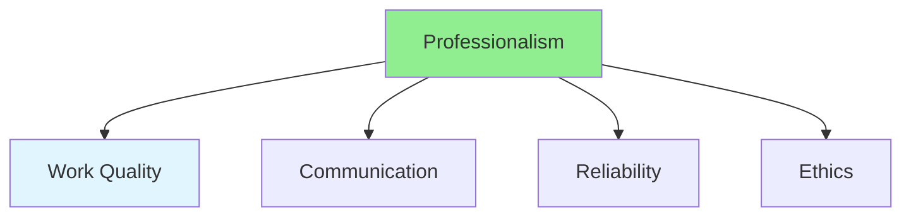

# 15.15 Professionalism / Chuyên nghiệp

## Table of Contents / Mục lục
1. [Introduction / Giới thiệu](#introduction--giới-thiệu)
2. [Professional Behavior / Hành vi chuyên nghiệp](#professional-behavior--hành-vi-chuyên-nghiệp)
3. [Best Practices / Thực hành tốt nhất](#best-practices--thực-hành-tốt-nhất)
4. [Summary / Tóm tắt](#summary--tóm-tắt)

---

## Introduction / Giới thiệu

### Overview / Tổng quan

**English**: Professionalism builds trust and credibility. Learn to maintain professional standards in communication, work quality, and behavior.

**Vietnamese**: Chuyên nghiệp xây dựng niềm tin và uy tín. Học cách duy trì tiêu chuẩn chuyên nghiệp trong giao tiếp, chất lượng công việc và hành vi.

### Professionalism Components / Thành phần chuyên nghiệp



---

## Professional Behavior / Hành vi chuyên nghiệp

### Example 1: Professional Standards / Ví dụ 1: Tiêu chuẩn chuyên nghiệp

```typescript
// Professional standards / Tiêu chuẩn chuyên nghiệp
interface ProfessionalStandards {
  workQuality: 'High standards, thorough';
  communication: 'Clear, respectful, timely';
  reliability: 'Meet commitments, on time';
  ethics: 'Honest, ethical behavior';
  continuousImprovement: 'Learn and grow';
}

// Maintain professionalism / Duy trì chuyên nghiệp
function maintainProfessionalism(): ProfessionalStandards {
  return {
    workQuality: 'Deliver high-quality work',
    communication: 'Communicate clearly and respectfully',
    reliability: 'Keep commitments and deadlines',
    ethics: 'Act with integrity',
    continuousImprovement: 'Continuously improve skills'
  };
}
```

---

## Best Practices / Thực hành tốt nhất

1. **Quality work** - Maintain high standards
2. **Reliability** - Keep commitments
3. **Respect** - Treat others respectfully
4. **Ethics** - Act with integrity
5. **Growth** - Continuous improvement

---

## Summary / Tóm tắt

### Key Takeaways / Điểm chính

- **Quality**: High work standards
- **Reliability**: Keep commitments
- **Respect**: Treat others well
- **Ethics**: Act with integrity
- **Growth**: Continuous improvement

### Next Steps / Bước tiếp theo

- Complete Group 15: Soft Skills ✅
- Move to [Group 16: Performance Testing](../Group-16-Performance-Testing/) - Coming next

---

**Last Updated / Cập nhật lần cuối**: 2024


