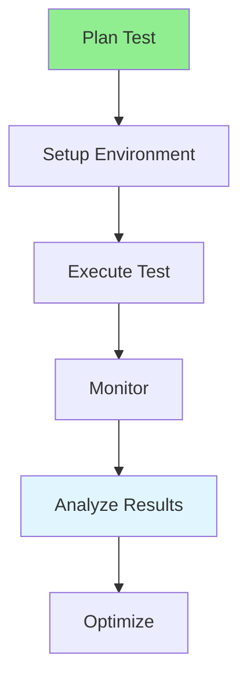

# 16.01 Performance Testing Basics / Cơ bản kiểm thử hiệu năng

## Table of Contents / Mục lục
1. [Introduction / Giới thiệu](#introduction--giới-thiệu)
2. [Testing Types / Loại kiểm thử](#testing-types--loại-kiểm-thử)
3. [Best Practices / Thực hành tốt nhất](#best-practices--thực-hành-tốt-nhất)
4. [Summary / Tóm tắt](#summary--tóm-tắt)

---

## Introduction / Giới thiệu

### Overview / Tổng quan

**English**: Performance testing ensures applications meet performance requirements. Learn to plan, execute, and analyze performance tests.

**Vietnamese**: Kiểm thử hiệu năng đảm bảo ứng dụng đáp ứng yêu cầu hiệu năng. Học cách lập kế hoạch, thực thi và phân tích kiểm thử hiệu năng.

### Performance Testing Flow / Luồng kiểm thử hiệu năng



---

## Testing Types / Loại kiểm thử

### Example 1: Performance Testing / Ví dụ 1: Kiểm thử hiệu năng

```typescript
// Performance testing / Kiểm thử hiệu năng
interface PerformanceTest {
  type: 'load' | 'stress' | 'endurance' | 'spike';
  users: number;
  duration: number; // seconds / giây
  rampUp: number; // seconds / giây
}

// Run performance test / Chạy kiểm thử hiệu năng
async function runPerformanceTest(test: PerformanceTest) {
  const results = {
    requestsPerSecond: 0,
    averageResponseTime: 0,
    errorRate: 0,
    throughput: 0
  };
  
  // Execute test / Thực thi kiểm thử
  return results;
}
```

---

## Best Practices / Thực hành tốt nhất

1. **Define metrics** - Clear performance goals
2. **Test realistic** - Use realistic scenarios
3. **Monitor resources** - Track CPU, memory, network
4. **Baseline** - Establish baseline performance
5. **Iterate** - Test, optimize, retest

---

## Summary / Tóm tắt

### Key Takeaways / Điểm chính

- **Types**: Load, stress, endurance, spike
- **Metrics**: Response time, throughput, error rate
- **Planning**: Define goals and scenarios
- **Analysis**: Identify bottlenecks

### Next Steps / Bước tiếp theo

- [16.02 Load Testing](./16.02_Load_Testing.md) - Next: Load Testing

---

**Last Updated / Cập nhật lần cuối**: 2024


