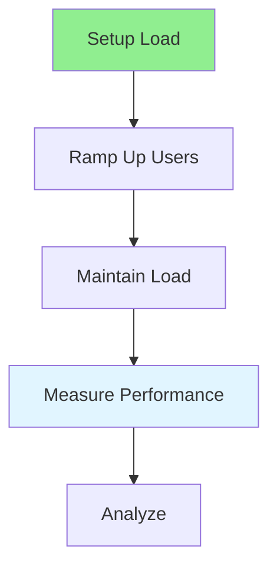
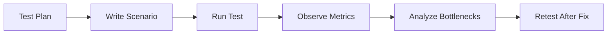

# 16.02 Load Testing / Kiểm thử tải

## Table of Contents / Mục lục
1. [Introduction / Giới thiệu](#introduction--giới-thiệu)
2. [Load Testing Process / Quy trình kiểm thử tải](#load-testing-process--quy-trình-kiểm-thử-tải)
3. [Scenarios / Kịch bản](#scenarios--kịch-bản)
4. [Metrics / Chỉ số](#metrics--chỉ-số)
5. [Best Practices / Thực hành tốt nhất](#best-practices--thực-hành-tốt-nhất)
6. [Summary / Tóm tắt](#summary--tóm-tắt)

---

## Introduction / Giới thiệu

### Overview / Tổng quan

**English**: Load testing measures system behavior under expected load. Learn to simulate realistic user loads and measure performance.

**Vietnamese**: Kiểm thử tải đo lường hành vi hệ thống dưới tải dự kiến. Học cách mô phỏng tải người dùng thực tế và đo lường hiệu năng.

### Load Testing Flow / Luồng kiểm thử tải



---

## Load Testing Process / Quy trình kiểm thử tải

### Example 1: Load Testing / Ví dụ 1: Kiểm thử tải

```typescript
// Load testing / Kiểm thử tải
import { k6 } from 'k6';

export const options = {
  stages: [
    { duration: '2m', target: 100 }, // Ramp up / Tăng dần
    { duration: '5m', target: 100 }, // Maintain / Duy trì
    { duration: '2m', target: 0 }    // Ramp down / Giảm dần
  ]
};

export default function() {
  http.get('https://api.example.com/users');
  sleep(1);
}
```

### Load Test Flow / Luồng load test



---

## Scenarios / Kịch bản

### Useful Scenario Types / Loại kịch bản hữu ích

- homepage or dashboard traffic
- login flow
- list endpoint with pagination
- checkout or order flow
- background-job-heavy periods

### What Makes A Test Realistic / Điều gì làm bài test thực tế

- authenticated and anonymous traffic mix
- realistic pauses between requests
- multiple endpoint types
- realistic payload size
- production-like database state

---

## Metrics / Chỉ số

### Measure At Least / Ít nhất cần đo

- p50 latency
- p95 latency
- p99 latency
- requests per second
- error rate
- CPU and memory
- database query behavior

### Example 2: Thresholds / Ví dụ 2: Ngưỡng

```typescript
export const options = {
  thresholds: {
    http_req_duration: ['p(95)<500'],
    http_req_failed: ['rate<0.01'],
  },
};
```

---

## Best Practices / Thực hành tốt nhất

1. **Realistic load** - Simulate actual usage
2. **Gradual ramp-up** - Increase load gradually
3. **Monitor metrics** - Track key indicators
4. **Baseline comparison** - Compare to baseline
5. **Document results** - Record findings
6. **Use production-like data shape** - Empty or tiny datasets hide real issues
7. **Watch downstream systems** - API tests often fail because of database or queue limits
8. **Retest after optimization** - Fixes are not complete until measured again

---

## Summary / Tóm tắt

### Key Takeaways / Điểm chính

- **Purpose**: Test under expected load
- **Ramp-up**: Gradual increase
- **Metrics**: Response time, throughput
- **Analysis**: Identify issues
- **Scenarios**: Good tests reflect real user behavior
- **Thresholds**: Define pass and fail criteria before running tests

### Next Steps / Bước tiếp theo

- [16.03 Stress Testing](./16.03_Stress_Testing.md) - Next: Stress Testing

---

**Last Updated / Cập nhật lần cuối**: 2024

