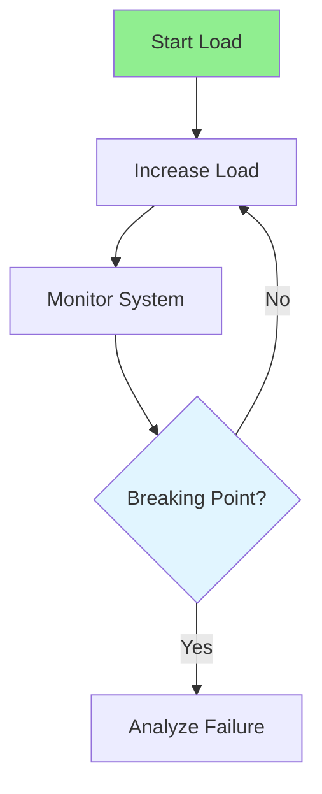

# 16.03 Stress Testing / Kiểm thử căng thẳng

## Table of Contents / Mục lục
1. [Introduction / Giới thiệu](#introduction--giới-thiệu)
2. [Stress Testing Process / Quy trình kiểm thử căng thẳng](#stress-testing-process--quy-trình-kiểm-thử-căng-thẳng)
3. [Failure Analysis / Phân tích lỗi](#failure-analysis--phân-tích-lỗi)
4. [Recovery / Phục hồi](#recovery--phục-hồi)
5. [Best Practices / Thực hành tốt nhất](#best-practices--thực-hành-tốt-nhất)
6. [Summary / Tóm tắt](#summary--tóm-tắt)

---

## Introduction / Giới thiệu

### Overview / Tổng quan

**English**: Stress testing finds system breaking points. Learn to test beyond normal capacity and identify failure points.

**Vietnamese**: Kiểm thử căng thẳng tìm điểm phá vỡ hệ thống. Học cách kiểm thử vượt quá dung lượng bình thường và xác định điểm lỗi.

### Stress Testing Flow / Luồng kiểm thử căng thẳng



---

## Stress Testing Process / Quy trình kiểm thử căng thẳng

### Example 1: Stress Testing / Ví dụ 1: Kiểm thử căng thẳng

```typescript
// Stress testing / Kiểm thử căng thẳng
export const options = {
  stages: [
    { duration: '1m', target: 50 },
    { duration: '2m', target: 100 },
    { duration: '2m', target: 200 },
    { duration: '2m', target: 300 }, // Beyond capacity / Vượt quá dung lượng
    { duration: '2m', target: 0 }
  ],
  thresholds: {
    http_req_duration: ['p(95)<500'],
    http_req_failed: ['rate<0.01']
  }
};
```

### Stress Curve / Đường cong stress


---

## Failure Analysis / Phân tích lỗi

### What Usually Breaks First / Thứ thường hỏng đầu tiên

- database saturation
- connection pool exhaustion
- queue backlog
- memory pressure
- CPU saturation
- timeout storms

### What To Capture / Cần ghi nhận gì

- exact load level at failure
- latency before failure
- error types
- resource metrics
- recovery time after load drops

---

## Recovery / Phục hồi

### Why Recovery Matters / Tại sao phục hồi quan trọng

A system that fails is one problem. A system that cannot recover cleanly is a larger problem.

### Recovery Questions / Câu hỏi về phục hồi

- does the system stabilize after traffic drops?
- do workers drain backlog?
- do pods or processes restart cleanly?
- does data remain consistent?

---

## Best Practices / Thực hành tốt nhất

1. **Exceed capacity** - Test beyond limits
2. **Monitor closely** - Watch for failures
3. **Identify limits** - Find breaking points
4. **Recovery** - Test recovery after stress
5. **Document** - Record failure points
6. **Fail in a controlled environment** - Never discover breaking points first in production
7. **Observe dependencies** - Many failures come from downstream systems
8. **Use findings to set safeguards** - Rate limits and autoscaling need real stress data

---

## Summary / Tóm tắt

### Key Takeaways / Điểm chính

- **Purpose**: Find breaking points
- **Method**: Exceed normal capacity
- **Monitoring**: Watch for failures
- **Recovery**: Test recovery
- **Analysis**: Breaking point data should drive capacity planning
- **Recovery**: Resilience matters as much as raw capacity

### Next Steps / Bước tiếp theo

- [16.04 Endurance Testing](./16.04_Endurance_Testing.md) - Next: Endurance Testing

---

**Last Updated / Cập nhật lần cuối**: 2024

