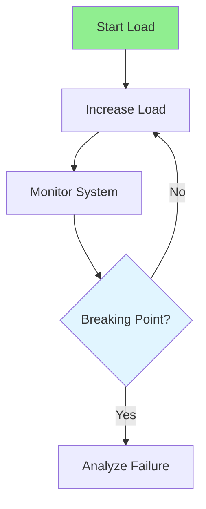

# 16.03 Stress Testing / Kiểm thử căng thẳng

## Table of Contents / Mục lục
1. [Introduction / Giới thiệu](#introduction--giới-thiệu)
2. [Stress Testing Process / Quy trình kiểm thử căng thẳng](#stress-testing-process--quy-trình-kiểm-thử-căng-thẳng)
3. [Best Practices / Thực hành tốt nhất](#best-practices--thực-hành-tốt-nhất)
4. [Summary / Tóm tắt](#summary--tóm-tắt)

---

## Introduction / Giới thiệu

### Overview / Tổng quan

**English**: Stress testing finds system breaking points. Learn to test beyond normal capacity and identify failure points.

**Vietnamese**: Kiểm thử căng thẳng tìm điểm phá vỡ hệ thống. Học cách kiểm thử vượt quá dung lượng bình thường và xác định điểm lỗi.

### Stress Testing Flow / Luồng kiểm thử căng thẳng



---

## Stress Testing Process / Quy trình kiểm thử căng thẳng

### Example 1: Stress Testing / Ví dụ 1: Kiểm thử căng thẳng

```typescript
// Stress testing / Kiểm thử căng thẳng
export const options = {
  stages: [
    { duration: '1m', target: 50 },
    { duration: '2m', target: 100 },
    { duration: '2m', target: 200 },
    { duration: '2m', target: 300 }, // Beyond capacity / Vượt quá dung lượng
    { duration: '2m', target: 0 }
  ],
  thresholds: {
    http_req_duration: ['p(95)<500'],
    http_req_failed: ['rate<0.01']
  }
};
```

---

## Best Practices / Thực hành tốt nhất

1. **Exceed capacity** - Test beyond limits
2. **Monitor closely** - Watch for failures
3. **Identify limits** - Find breaking points
4. **Recovery** - Test recovery after stress
5. **Document** - Record failure points

---

## Summary / Tóm tắt

### Key Takeaways / Điểm chính

- **Purpose**: Find breaking points
- **Method**: Exceed normal capacity
- **Monitoring**: Watch for failures
- **Recovery**: Test recovery

### Next Steps / Bước tiếp theo

- [16.04 Endurance Testing](./16.04_Endurance_Testing.md) - Next: Endurance Testing

---

**Last Updated / Cập nhật lần cuối**: 2024

