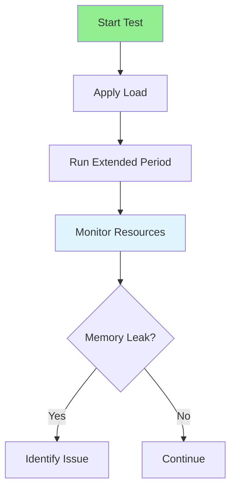

# 16.04 Endurance Testing / Kiểm thử độ bền

## Table of Contents / Mục lục
1. [Introduction / Giới thiệu](#introduction--giới-thiệu)
2. [Endurance Testing Process / Quy trình kiểm thử độ bền](#endurance-testing-process--quy-trình-kiểm-thử-độ-bền)
3. [Best Practices / Thực hành tốt nhất](#best-practices--thực-hành-tốt-nhất)
4. [Summary / Tóm tắt](#summary--tóm-tắt)

---

## Introduction / Giới thiệu

### Overview / Tổng quan

**English**: Endurance testing checks system stability over time. Learn to test for memory leaks, resource exhaustion, and long-term stability.

**Vietnamese**: Kiểm thử độ bền kiểm tra tính ổn định hệ thống theo thời gian. Học cách kiểm thử memory leak, cạn kiệt tài nguyên và ổn định dài hạn.

### Endurance Testing Flow / Luồng kiểm thử độ bền



---

## Endurance Testing Process / Quy trình kiểm thử độ bền

### Example 1: Endurance Testing / Ví dụ 1: Kiểm thử độ bền

```typescript
// Endurance testing / Kiểm thử độ bền
export const options = {
  vus: 50,
  duration: '24h', // Extended period / Thời gian dài
  thresholds: {
    http_req_duration: ['p(95)<500'],
    memory_usage: ['value<500MB'] // Monitor memory / Theo dõi bộ nhớ
  }
};

export default function() {
  http.get('https://api.example.com/data');
  sleep(1);
}

// Monitor memory / Theo dõi bộ nhớ
function checkMemoryLeak() {
  const memory = process.memoryUsage();
  if (memory.heapUsed > 500 * 1024 * 1024) {
    console.warn('Potential memory leak detected');
  }
}
```

---

## Best Practices / Thực hành tốt nhất

1. **Extended duration** - Run for hours/days
2. **Monitor resources** - Track memory, CPU
3. **Check for leaks** - Memory and resource leaks
4. **Baseline comparison** - Compare over time
5. **Document degradation** - Record performance decline

---

## Summary / Tóm tắt

### Key Takeaways / Điểm chính

- **Duration**: Extended testing period
- **Memory**: Check for leaks
- **Resources**: Monitor usage
- **Stability**: Long-term stability

### Next Steps / Bước tiếp theo

- [16.05 Performance Metrics](./16.05_Performance_Metrics.md) - Next: Performance Metrics

---

**Last Updated / Cập nhật lần cuối**: 2024


