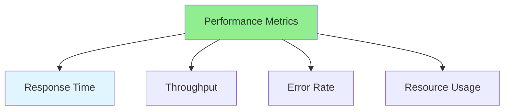

# 16.05 Performance Metrics / Chỉ số hiệu năng

## Table of Contents / Mục lục
1. [Introduction / Giới thiệu](#introduction--giới-thiệu)
2. [Key Metrics / Chỉ số chính](#key-metrics--chỉ-số-chính)
3. [Best Practices / Thực hành tốt nhất](#best-practices--thực-hành-tốt-nhất)
4. [Summary / Tóm tắt](#summary--tóm-tắt)

---

## Introduction / Giới thiệu

### Overview / Tổng quan

**English**: Performance metrics quantify system performance. Learn to measure and track key performance indicators.

**Vietnamese**: Chỉ số hiệu năng định lượng hiệu năng hệ thống. Học cách đo lường và theo dõi chỉ số hiệu năng chính.

### Performance Metrics / Chỉ số hiệu năng



---

## Key Metrics / Chỉ số chính

### Example 1: Performance Metrics / Ví dụ 1: Chỉ số hiệu năng

```typescript
// Performance metrics / Chỉ số hiệu năng
interface PerformanceMetrics {
  responseTime: {
    average: number; // ms / ms
    p50: number; // median / trung vị
    p95: number; // 95th percentile / phần trăm thứ 95
    p99: number; // 99th percentile / phần trăm thứ 99
  };
  throughput: number; // requests per second / requests mỗi giây
  errorRate: number; // percentage / phần trăm
  resourceUsage: {
    cpu: number; // percentage / phần trăm
    memory: number; // MB / MB
    network: number; // Mbps / Mbps
  };
}

// Collect metrics / Thu thập chỉ số
function collectMetrics(): PerformanceMetrics {
  return {
    responseTime: {
      average: 150,
      p50: 120,
      p95: 300,
      p99: 500
    },
    throughput: 1000,
    errorRate: 0.1,
    resourceUsage: {
      cpu: 60,
      memory: 512,
      network: 100
    }
  };
}
```

---

## Best Practices / Thực hành tốt nhất

1. **Define SLAs** - Set performance targets
2. **Track percentiles** - P50, P95, P99
3. **Monitor continuously** - Real-time monitoring
4. **Alert on thresholds** - Set up alerts
5. **Trend analysis** - Track over time

---

## Summary / Tóm tắt

### Key Takeaways / Điểm chính

- **Response time**: Average and percentiles
- **Throughput**: Requests per second
- **Error rate**: Failure percentage
- **Resources**: CPU, memory, network

### Next Steps / Bước tiếp theo

- [16.06 Bottleneck Identification](./16.06_Bottleneck_Identification.md) - Next: Bottleneck Identification

---

**Last Updated / Cập nhật lần cuối**: 2024

