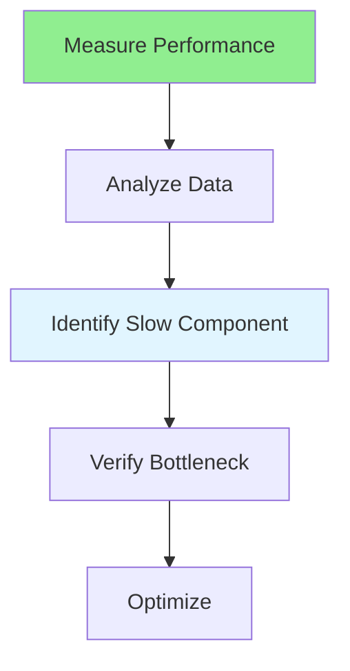

# 16.06 Bottleneck Identification / Xác định nút thắt

## Table of Contents / Mục lục
1. [Introduction / Giới thiệu](#introduction--giới-thiệu)
2. [Bottleneck Types / Loại nút thắt](#bottleneck-types--loại-nút-thắt)
3. [Identification Methods / Phương pháp xác định](#identification-methods--phương-pháp-xác-định)
4. [Best Practices / Thực hành tốt nhất](#best-practices--thực-hành-tốt-nhất)
5. [Summary / Tóm tắt](#summary--tóm-tắt)

---

## Introduction / Giới thiệu

### Overview / Tổng quan

**English**: Identifying bottlenecks is key to optimization. Learn to find performance bottlenecks in code, database, and infrastructure.

**Vietnamese**: Xác định nút thắt là chìa khóa cho tối ưu. Học cách tìm nút thắt hiệu năng trong code, database và hạ tầng.

### Bottleneck Identification Flow / Luồng xác định nút thắt



---

## Bottleneck Types / Loại nút thắt

### Example 1: Bottleneck Identification / Ví dụ 1: Xác định nút thắt

```typescript
// Bottleneck identification / Xác định nút thắt
interface Bottleneck {
  type: 'cpu' | 'memory' | 'database' | 'network' | 'code';
  location: string;
  impact: 'high' | 'medium' | 'low';
  solution: string;
}

// Identify bottlenecks / Xác định nút thắt
function identifyBottlenecks(metrics: PerformanceMetrics): Bottleneck[] {
  const bottlenecks: Bottleneck[] = [];
  
  if (metrics.resourceUsage.cpu > 90) {
    bottlenecks.push({
      type: 'cpu',
      location: 'Application server',
      impact: 'high',
      solution: 'Optimize CPU-intensive operations'
    });
  }
  
  if (metrics.responseTime.p95 > 1000) {
    bottlenecks.push({
      type: 'database',
      location: 'Database queries',
      impact: 'high',
      solution: 'Optimize queries, add indexes'
    });
  }
  
  return bottlenecks;
}
```

---

## Best Practices / Thực hành tốt nhất

1. **Profile code** - Use profiling tools
2. **Monitor resources** - Track CPU, memory
3. **Database analysis** - Slow query logs
4. **Network analysis** - Check latency
5. **Prioritize** - Fix high-impact bottlenecks

---

## Summary / Tóm tắt

### Key Takeaways / Điểm chính

- **Types**: CPU, memory, database, network, code
- **Identification**: Profiling and monitoring
- **Analysis**: Root cause analysis
- **Optimization**: Fix bottlenecks

### Next Steps / Bước tiếp theo

- [16.07 Database Performance](./16.07_Database_Performance.md) - Next: Database Performance

---

**Last Updated / Cập nhật lần cuối**: 2024

