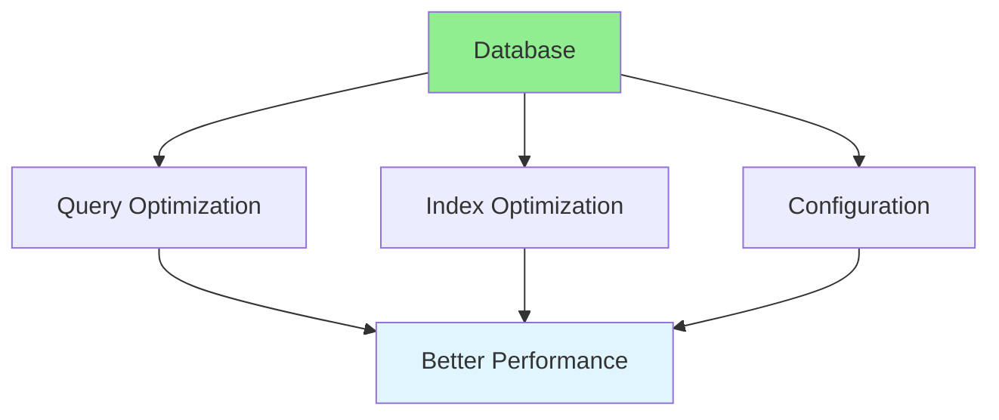
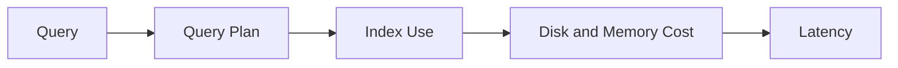

# 16.07 Database Performance / Hiệu năng database

## Table of Contents / Mục lục
1. [Introduction / Giới thiệu](#introduction--giới-thiệu)
2. [Optimization Techniques / Kỹ thuật tối ưu](#optimization-techniques--kỹ-thuật-tối-ưu)
3. [Bottlenecks / Điểm nghẽn](#bottlenecks--điểm-nghẽn)
4. [Measurement / Đo lường](#measurement--đo-lường)
5. [Best Practices / Thực hành tốt nhất](#best-practices--thực-hành-tốt-nhất)
6. [Summary / Tóm tắt](#summary--tóm-tắt)

---

## Introduction / Giới thiệu

### Overview / Tổng quan

**English**: Database performance is critical for application speed. Learn to optimize queries, indexes, and database configuration.

**Vietnamese**: Hiệu năng database rất quan trọng cho tốc độ ứng dụng. Học cách tối ưu queries, indexes và cấu hình database.

### Database Optimization / Tối ưu database



---

## Optimization Techniques / Kỹ thuật tối ưu

### Example 1: Database Optimization / Ví dụ 1: Tối ưu database

```typescript
// Database optimization / Tối ưu database
// Optimized query / Query tối ưu
async function optimizedQuery(userId: string) {
  return await prisma.user.findUnique({
    where: { id: userId },
    select: { // Only select needed fields / Chỉ chọn fields cần thiết
      id: true,
      name: true,
      email: true
    },
    include: {
      orders: {
        take: 10, // Limit related data / Giới hạn dữ liệu liên quan
        orderBy: { createdAt: 'desc' }
      }
    }
  });
}

// Add index / Thêm index
// CREATE INDEX idx_user_email ON users(email);
// CREATE INDEX idx_order_user_created ON orders(user_id, created_at);
```

### Database Performance Flow / Luồng hiệu năng database



---

## Bottlenecks / Điểm nghẽn

### Common Bottlenecks / Điểm nghẽn phổ biến

- missing indexes
- N+1 query patterns
- full table scans
- too much selected data
- connection saturation
- lock contention

---

## Measurement / Đo lường

### What To Measure / Cần đo gì

- query latency
- query count per request
- index hit ratio
- connection usage
- lock wait time
- cache hit ratio

### Example 2: Explain Analyze / Ví dụ 2: Explain Analyze

```sql
EXPLAIN ANALYZE
SELECT *
FROM orders
WHERE user_id = 42
ORDER BY created_at DESC
LIMIT 20;
```

---

## Best Practices / Thực hành tốt nhất

1. **Index optimization** - Add appropriate indexes
2. **Query optimization** - Optimize slow queries
3. **Connection pooling** - Reuse connections
4. **Caching** - Cache frequently accessed data
5. **Monitoring** - Track query performance
6. **Select less data** - Smaller payloads reduce cost
7. **Measure before tuning** - Optimization without measurement is guesswork
8. **Review query patterns continuously** - App changes create new database regressions

---

## Summary / Tóm tắt

### Key Takeaways / Điểm chính

- **Indexes**: Add for frequently queried fields
- **Queries**: Optimize slow queries
- **Connection pooling**: Reuse connections
- **Caching**: Reduce database load
- **Bottlenecks**: Query shape and data access patterns dominate performance
- **Measurement**: Explain plans and metrics should drive tuning

### Next Steps / Bước tiếp theo

- [16.08 API Performance](./16.08_API_Performance.md) - Next: API Performance

---

**Last Updated / Cập nhật lần cuối**: 2024

