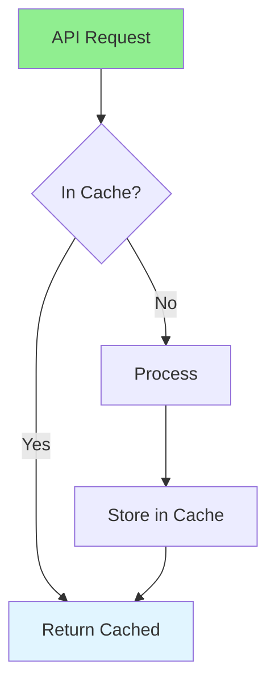

# 16.08 API Performance / Hiệu năng API

## Table of Contents / Mục lục
1. [Introduction / Giới thiệu](#introduction--giới-thiệu)
2. [API Optimization / Tối ưu API](#api-optimization--tối-ưu-api)
3. [Best Practices / Thực hành tốt nhất](#best-practices--thực-hành-tốt-nhất)
4. [Summary / Tóm tắt](#summary--tóm-tắt)

---

## Introduction / Giới thiệu

### Overview / Tổng quan

**English**: API performance affects user experience. Learn to optimize API response times, implement caching, and reduce latency.

**Vietnamese**: Hiệu năng API ảnh hưởng trải nghiệm người dùng. Học cách tối ưu thời gian phản hồi API, triển khai caching và giảm độ trễ.

### API Performance Flow / Luồng hiệu năng API



---

## API Optimization / Tối ưu API

### Example 1: API Optimization / Ví dụ 1: Tối ưu API

```typescript
// API optimization / Tối ưu API
@Controller('api')
export class ApiController {
  constructor(
    private cacheService: CacheService,
    private userService: UserService
  ) {}
  
  @Get('users/:id')
  @UseInterceptors(CacheInterceptor)
  @CacheTTL(300) // 5 minutes / 5 phút
  async getUser(@Param('id') id: string) {
    return this.userService.findById(id);
  }
  
  // Pagination / Phân trang
  @Get('users')
  async getUsers(
    @Query('page') page: number = 1,
    @Query('limit') limit: number = 20
  ) {
    return this.userService.findMany({
      skip: (page - 1) * limit,
      take: limit
    });
  }
}
```

---

## Best Practices / Thực hành tốt nhất

1. **Caching** - Cache responses
2. **Pagination** - Limit result size
3. **Compression** - Compress responses
4. **Async processing** - Use async operations
5. **Rate limiting** - Protect APIs

---

## Summary / Tóm tắt

### Key Takeaways / Điểm chính

- **Caching**: Cache API responses
- **Pagination**: Limit data returned
- **Compression**: Reduce payload size
- **Async**: Non-blocking operations

### Next Steps / Bước tiếp theo

- [16.09 Frontend Performance](./16.09_Frontend_Performance.md) - Next: Frontend Performance

---

**Last Updated / Cập nhật lần cuối**: 2024

