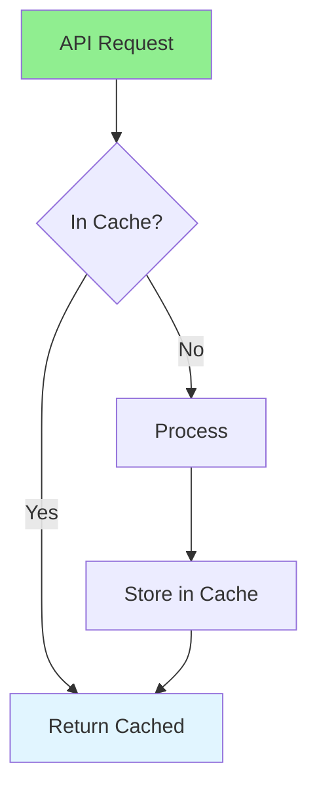
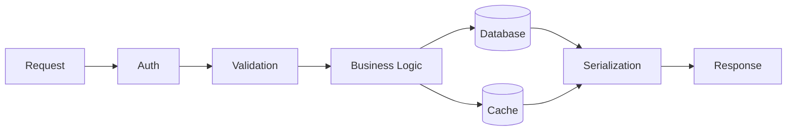

# 16.08 API Performance / Hiệu năng API

## Table of Contents / Mục lục
1. [Introduction / Giới thiệu](#introduction--giới-thiệu)
2. [API Optimization / Tối ưu API](#api-optimization--tối-ưu-api)
3. [Latency Breakdown / Phân rã độ trễ](#latency-breakdown--phân-rã-độ-trễ)
4. [Measurement / Đo lường](#measurement--đo-lường)
5. [Best Practices / Thực hành tốt nhất](#best-practices--thực-hành-tốt-nhất)
6. [Summary / Tóm tắt](#summary--tóm-tắt)

---

## Introduction / Giới thiệu

### Overview / Tổng quan

**English**: API performance affects user experience. Learn to optimize API response times, implement caching, and reduce latency.

**Vietnamese**: Hiệu năng API ảnh hưởng trải nghiệm người dùng. Học cách tối ưu thời gian phản hồi API, triển khai caching và giảm độ trễ.

### API Performance Flow / Luồng hiệu năng API



---

## API Optimization / Tối ưu API

### Example 1: API Optimization / Ví dụ 1: Tối ưu API

```typescript
// API optimization / Tối ưu API
@Controller('api')
export class ApiController {
  constructor(
    private cacheService: CacheService,
    private userService: UserService
  ) {}
  
  @Get('users/:id')
  @UseInterceptors(CacheInterceptor)
  @CacheTTL(300) // 5 minutes / 5 phút
  async getUser(@Param('id') id: string) {
    return this.userService.findById(id);
  }
  
  // Pagination / Phân trang
  @Get('users')
  async getUsers(
    @Query('page') page: number = 1,
    @Query('limit') limit: number = 20
  ) {
    return this.userService.findMany({
      skip: (page - 1) * limit,
      take: limit
    });
  }
}
```

### Example 2: Express Performance Middleware / Ví dụ 2: Middleware hiệu năng cho Express

```typescript
import type { Request, Response, NextFunction } from 'express';

export function requestTimer(req: Request, res: Response, next: NextFunction) {
  const start = performance.now();

  res.on('finish', () => {
    const duration = performance.now() - start;
    console.log({
      method: req.method,
      path: req.path,
      status: res.statusCode,
      durationMs: Number(duration.toFixed(2)),
    });
  });

  next();
}
```

### Example 3: Database-Aware Pagination / Ví dụ 3: Phân trang thân thiện với database

```typescript
async function listUsers(cursor?: string, limit: number = 20) {
  return prisma.user.findMany({
    take: limit,
    ...(cursor ? { skip: 1, cursor: { id: cursor } } : {}),
    orderBy: { id: 'asc' },
  });
}
```

---

## Latency Breakdown / Phân rã độ trễ

### Where API Time Goes / Thời gian API đi đâu



Common latency sources:

- slow database queries
- large response payloads
- repeated remote calls
- missing indexes
- no caching strategy
- synchronous heavy work in request path

---

## Measurement / Đo lường

### Example 4: What To Measure / Ví dụ 4: Nên đo gì

- p50 latency
- p95 latency
- p99 latency
- error rate
- throughput
- database query count per request
- cache hit rate

### Example 5: Response Compression / Ví dụ 5: Nén response

```typescript
import compression from 'compression';
app.use(compression());
```

### Practical Checklist / Danh sách kiểm tra thực tế

- add pagination for list endpoints
- avoid returning entire records by default
- cache read-heavy endpoints
- move slow background work into jobs or queues
- log per-request duration
- inspect database queries under load

---

## Best Practices / Thực hành tốt nhất

1. **Caching** - Cache responses
2. **Pagination** - Limit result size
3. **Compression** - Compress responses
4. **Async processing** - Use async operations
5. **Rate limiting** - Protect APIs
6. **Observe p95 and p99** - Averages hide real user pain
7. **Measure database cost** - API latency is often data latency
8. **Avoid chatty endpoints** - Reduce repeated round trips

---

## Summary / Tóm tắt

### Key Takeaways / Điểm chính

- **Caching**: Cache API responses
- **Pagination**: Limit data returned
- **Compression**: Reduce payload size
- **Async**: Non-blocking operations
- **Metrics**: Track latency percentiles and error rate
- **Database**: Optimize query count and query plans

### Next Steps / Bước tiếp theo

- [16.09 Frontend Performance](./16.09_Frontend_Performance.md) - Next: Frontend Performance

---

**Last Updated / Cập nhật lần cuối**: 2024

