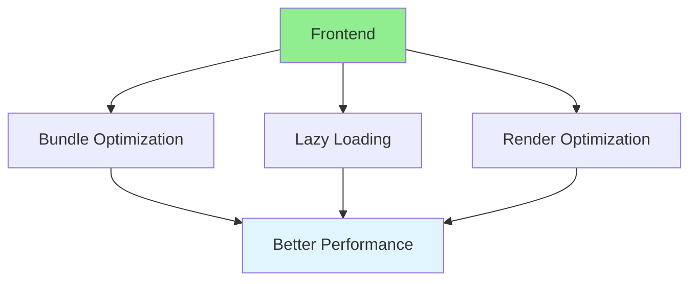

# 16.09 Frontend Performance / Hiệu năng frontend

## Table of Contents / Mục lục
1. [Introduction / Giới thiệu](#introduction--giới-thiệu)
2. [Optimization Techniques / Kỹ thuật tối ưu](#optimization-techniques--kỹ-thuật-tối-ưu)
3. [Best Practices / Thực hành tốt nhất](#best-practices--thực-hành-tốt-nhất)
4. [Summary / Tóm tắt](#summary--tóm-tắt)

---

## Introduction / Giới thiệu

### Overview / Tổng quan

**English**: Frontend performance impacts user experience. Learn to optimize bundle size, lazy load, and improve rendering performance.

**Vietnamese**: Hiệu năng frontend ảnh hưởng trải nghiệm người dùng. Học cách tối ưu kích thước bundle, lazy load và cải thiện hiệu năng rendering.

### Frontend Optimization / Tối ưu frontend



---

## Optimization Techniques / Kỹ thuật tối ưu

### Example 1: Frontend Optimization / Ví dụ 1: Tối ưu frontend

```typescript
// Frontend optimization / Tối ưu frontend
// Code splitting / Chia nhỏ code
import { lazy, Suspense } from 'react';

const HeavyComponent = lazy(() => import('./HeavyComponent'));

function App() {
  return (
    <Suspense fallback={<div>Loading...</div>}>
      <HeavyComponent />
    </Suspense>
  );
}

// Memoization / Ghi nhớ
import { useMemo, memo } from 'react';

const ExpensiveComponent = memo(({ data }: { data: any[] }) => {
  const processed = useMemo(() => {
    return data.map(item => expensiveOperation(item));
  }, [data]);
  
  return <div>{processed}</div>;
});
```

---

## Best Practices / Thực hành tốt nhất

1. **Code splitting** - Split bundles
2. **Lazy loading** - Load on demand
3. **Memoization** - Cache computations
4. **Image optimization** - Optimize images
5. **Bundle analysis** - Analyze bundle size

---

## Summary / Tóm tắt

### Key Takeaways / Điểm chính

- **Bundle size**: Minimize bundle
- **Lazy loading**: Load on demand
- **Memoization**: Cache computations
- **Rendering**: Optimize render cycles

### Next Steps / Bước tiếp theo

- [16.10 Caching Strategies](./16.10_Caching_Strategies.md) - Next: Caching Strategies

---

**Last Updated / Cập nhật lần cuối**: 2024


