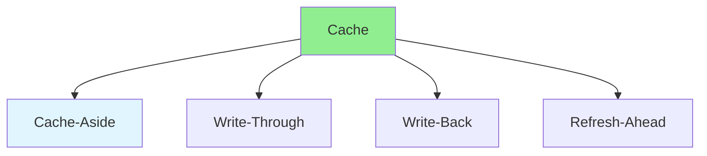

# 16.10 Caching Strategies / Chiến lược cache

## Table of Contents / Mục lục
1. [Introduction / Giới thiệu](#introduction--giới-thiệu)
2. [Caching Patterns / Mẫu cache](#caching-patterns--mẫu-cache)
3. [Best Practices / Thực hành tốt nhất](#best-practices--thực-hành-tốt-nhất)
4. [Summary / Tóm tắt](#summary--tóm-tắt)

---

## Introduction / Giới thiệu

### Overview / Tổng quan

**English**: Effective caching improves performance significantly. Learn different caching strategies and when to use each.

**Vietnamese**: Caching hiệu quả cải thiện hiệu năng đáng kể. Học các chiến lược caching khác nhau và khi nào sử dụng mỗi chiến lược.

### Caching Strategies / Chiến lược cache



---

## Caching Patterns / Mẫu cache

### Example 1: Caching Strategies / Ví dụ 1: Chiến lược cache

```typescript
// Cache-aside pattern / Mẫu cache-aside
class CacheAsideService {
  async get(id: string) {
    // Check cache / Kiểm tra cache
    const cached = await cache.get(`item:${id}`);
    if (cached) return cached;
    
    // Load from database / Tải từ database
    const item = await repository.findById(id);
    
    // Store in cache / Lưu vào cache
    await cache.set(`item:${id}`, item, 3600);
    
    return item;
  }
}

// Write-through pattern / Mẫu write-through
class WriteThroughService {
  async update(id: string, data: any) {
    // Update database / Cập nhật database
    const updated = await repository.update(id, data);
    
    // Update cache / Cập nhật cache
    await cache.set(`item:${id}`, updated, 3600);
    
    return updated;
  }
}
```

---

## Best Practices / Thực hành tốt nhất

1. **Choose strategy** - Match to use case
2. **Set TTL** - Appropriate expiration
3. **Invalidate** - Clear stale data
4. **Monitor** - Track hit rates
5. **Layer caching** - Multiple cache levels

---

## Summary / Tóm tắt

### Key Takeaways / Điểm chính

- **Patterns**: Cache-aside, write-through, write-back
- **TTL**: Time-to-live
- **Invalidation**: Clear stale data
- **Monitoring**: Track performance

### Next Steps / Bước tiếp theo

- [16.11 CDN Optimization](./16.11_CDN_Optimization.md) - Next: CDN Optimization

---

**Last Updated / Cập nhật lần cuối**: 2024


