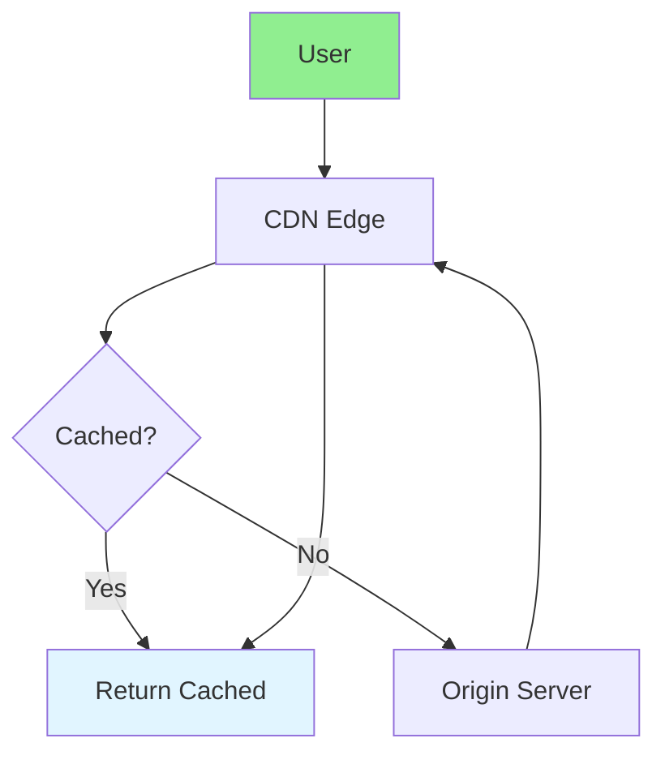

# 16.11 CDN Optimization / Tối ưu CDN

## Table of Contents / Mục lục
1. [Introduction / Giới thiệu](#introduction--giới-thiệu)
2. [CDN Configuration / Cấu hình CDN](#cdn-configuration--cấu-hình-cdn)
3. [Best Practices / Thực hành tốt nhất](#best-practices--thực-hành-tốt-nhất)
4. [Summary / Tóm tắt](#summary--tóm-tắt)

---

## Introduction / Giới thiệu

### Overview / Tổng quan

**English**: CDN improves content delivery speed. Learn to configure CDN, cache static assets, and optimize content delivery.

**Vietnamese**: CDN cải thiện tốc độ phân phối nội dung. Học cách cấu hình CDN, cache static assets và tối ưu phân phối nội dung.

### CDN Flow / Luồng CDN



---

## CDN Configuration / Cấu hình CDN

### Example 1: CDN Setup / Ví dụ 1: Thiết lập CDN

```typescript
// CDN configuration / Cấu hình CDN
const cdnConfig = {
  staticAssets: {
    cacheControl: 'public, max-age=31536000', // 1 year / 1 năm
    files: ['*.js', '*.css', '*.png', '*.jpg']
  },
  apiResponses: {
    cacheControl: 'public, max-age=300', // 5 minutes / 5 phút
    vary: 'Accept-Encoding'
  },
  html: {
    cacheControl: 'no-cache',
    revalidate: 60 // ISR / ISR
  }
};

// Next.js CDN / CDN Next.js
// next.config.js
module.exports = {
  assetPrefix: 'https://cdn.example.com',
  images: {
    domains: ['cdn.example.com']
  }
};
```

---

## Best Practices / Thực hành tốt nhất

1. **Cache static assets** - Long TTL for static files
2. **Cache headers** - Proper cache-control
3. **Compression** - Enable gzip/brotli
4. **Edge locations** - Choose close locations
5. **Purge cache** - Invalidate when needed

---

## Summary / Tóm tắt

### Key Takeaways / Điểm chính

- **Purpose**: Faster content delivery
- **Configuration**: Cache headers
- **Static assets**: Long cache TTL
- **Dynamic content**: Shorter TTL

### Next Steps / Bước tiếp theo

- [16.12 Memory Optimization](./16.12_Memory_Optimization.md) - Next: Memory Optimization

---

**Last Updated / Cập nhật lần cuối**: 2024


