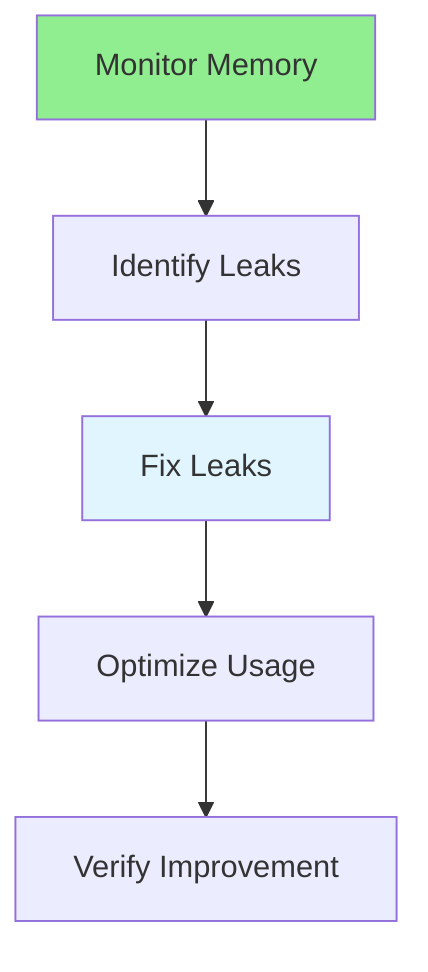

# 16.12 Memory Optimization / Tối ưu bộ nhớ

## Table of Contents / Mục lục
1. [Introduction / Giới thiệu](#introduction--giới-thiệu)
2. [Memory Management / Quản lý bộ nhớ](#memory-management--quản-lý-bộ-nhớ)
3. [Best Practices / Thực hành tốt nhất](#best-practices--thực-hành-tốt-nhất)
4. [Summary / Tóm tắt](#summary--tóm-tắt)

---

## Introduction / Giới thiệu

### Overview / Tổng quan

**English**: Memory optimization prevents leaks and improves performance. Learn to identify memory leaks, optimize memory usage, and manage resources.

**Vietnamese**: Tối ưu bộ nhớ ngăn chặn leak và cải thiện hiệu năng. Học cách xác định memory leak, tối ưu sử dụng bộ nhớ và quản lý tài nguyên.

### Memory Optimization Flow / Luồng tối ưu bộ nhớ



---

## Memory Management / Quản lý bộ nhớ

### Example 1: Memory Optimization / Ví dụ 1: Tối ưu bộ nhớ

```typescript
// Memory optimization / Tối ưu bộ nhớ
// Monitor memory / Theo dõi bộ nhớ
function monitorMemory() {
  const usage = process.memoryUsage();
  console.log({
    heapUsed: `${Math.round(usage.heapUsed / 1024 / 1024)}MB`,
    heapTotal: `${Math.round(usage.heapTotal / 1024 / 1024)}MB`,
    external: `${Math.round(usage.external / 1024 / 1024)}MB`
  });
}

// Prevent memory leaks / Ngăn chặn memory leak
class EventManager {
  private listeners: Map<string, Function[]> = new Map();
  
  on(event: string, listener: Function): void {
    if (!this.listeners.has(event)) {
      this.listeners.set(event, []);
    }
    this.listeners.get(event)!.push(listener);
  }
  
  off(event: string, listener: Function): void {
    const listeners = this.listeners.get(event);
    if (listeners) {
      this.listeners.set(event, listeners.filter(l => l !== listener));
    }
  }
  
  // Cleanup / Dọn dẹp
  cleanup(): void {
    this.listeners.clear();
  }
}
```

---

## Best Practices / Thực hành tốt nhất

1. **Monitor memory** - Track usage
2. **Fix leaks** - Remove event listeners
3. **Limit data** - Don't load all data
4. **Stream processing** - Process in chunks
5. **Garbage collection** - Allow GC to run

---

## Summary / Tóm tắt

### Key Takeaways / Điểm chính

- **Monitoring**: Track memory usage
- **Leaks**: Identify and fix
- **Limits**: Limit data size
- **Streaming**: Process in chunks

### Next Steps / Bước tiếp theo

- [16.13 CPU Optimization](./16.13_CPU_Optimization.md) - Next: CPU Optimization

---

**Last Updated / Cập nhật lần cuối**: 2024


